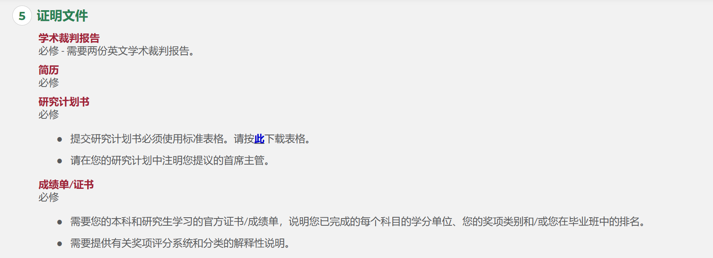

- 港理工申请清单
	- 文件要求
	  id:: 652bac1d-0fe8-443d-8f5e-344d62fe4799
		- 最好是**PDF格式**。
		- PDF 文件不得具有数字签名。
		- 不要包括密码保护，因为它会阻止我们打开文件。
		- 建议以 **300 dpi 分辨率扫描**。
		- **黑白扫描。**
		- 确保您的全名出现在所有上传的文档中。
		- 所有上传的文件必须清晰易读。确保所有关键和识别标记和信息清晰可辨;对于成绩单，这些包括机构的名称和评分方案、您的姓名、您的课程名称和您获得的成绩。
		- 每个文件不得超过 **5 MB （5,000 KB**）。
		- 页面方向：**请确保扫描文档的方向与原始文档的方向一致**。例如，应扫描垂直打印（纵向）的成绩单，使其以纵向格式显示。水平打印（横向）的成绩单应以横向格式显示。
		- **不要将所有支持文件作为一个文件上传**！选择上传的每个资格/结果必须与上传的文件匹配。
		- 每次提交时，**每个清单项目创建一个电子文**件。如果您的文档包含多个页面，请确保这些页面包含在单个电子文件中并上传，并且页面顺序正确。
		- 预览您的文档，**因为提交后您将无法编辑或删除它们**。上传文件可能需要几秒钟。请注意，在繁忙时段，上传时间可能会更长。
	- DONE 托福成绩-- 核查成绩数据
		- - 上传官方分数报告的扫描副本。入院后，你须要求有关考试机构将正式成绩报告正本直接寄送至理大。如果不这样做或发现任何差异，可能会导致您的录取通知书和在我们大学的注册无效。
	- 成绩说明
		- 可以是中文--搞定
	- 其他
		- ## 添加课外活动/志愿者工作/社区服务
		  collapsed:: true
			- 生医工助管--证明 #清单    周二
			- 交大吉他协会宣传部长 #清单 周三
			- 小叶子--待定
			- 图书馆青志队部长 -- 证明 #清单  周二
			- 书展志愿者
			- 物品整理
		- ## 添加奖品和奖励
		  collapsed:: true
			- **按照时间倒序**
			- 校友奖学金  -- 搞定
			- 苏州育才奖学金 -- 搞定
			- 数学建模二等奖
			- 校级三好学生 -- 搞定
			- 全国三等奖--生物医学工程竞赛 -- 搞定
		- 简历 周四
		- 推荐信 -- 周五最后
		- 证书、成绩单、**评分说明、班级证明**
		- 
	- 今晚：校级三好学生
	- 明日 -- 图书馆、学院、成绩单说明资料、重新开GPA成绩单、校友奖学金、身份证复印件
	- 周三 -- 吉协证明、推荐信
	- 周四 -- 完成申请
- 港城市申请清单
	- 所有上载文件的总文件大小不得超过10MB
	- 成绩单
	- merits
	- 身份证复印件 -- 搞定
	- 验证报告 #清单
	- 成就
-