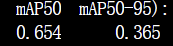
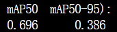
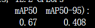
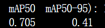

- 每日任务
	- **任务** #今日计划
		- #+BEGIN_QUERY
		  {:title ["🎯 日程"]
		  :query [:find (pull ?b [*])
		    :in $ ?dag
		    :where
		     [?b :block/scheduled ?dag]
		   ]
		   :inputs [:today]
		  }
		  #+END_QUERY
		- #+BEGIN_QUERY
		  {:title ["🎯 Deadline"]
		  :query [:find (pull ?b [*])
		    :in $ ?dag
		    :where
		     [?b :block/deadline ?dag]
		   ]
		   :inputs [:today]
		  }
		  #+END_QUERY
	- **近日反思**
	  #+BEGIN_QUERY
	  {:query [:find (pull ?b [*])
	           :in $ ?start ?today ?tag
	           :where
	           (between ?b ?start ?today)
	           (page-ref ?b ?tag)]
	   :inputs [:-7d :-1d "反思"]}
	  #+END_QUERY
	- **复习**
		- query-table:: false
		  #+BEGIN_QUERY
		  {:title "复习清单"
		   :query [:find (pull ?b [*])
		           :in $ ?start ?today ?tag
		           :where
		           (between ?b ?start ?today)
		           (page-ref ?b ?tag)]
		   :inputs [:-2d :-1d "复习"]}
		  #+END_QUERY
		- {{cards [[模型分析]] }}
	- collapsed:: true
	  #+BEGIN_QUERY
	  {:title [:h4 "🎯 所有计划"]
	   :query [:find (pull ?b [*])
	    :where
	     ; Add the criteria for which ?b you want to find here. I've added all tasks as an example.
	     [?b :block/marker ?m]
	     (not [(contains? #{"DONE" "CANCELED"} ?m)] )
	   ]
	   :result-transform (fn [result] 
	     (sort-by ; Any sort field here.
	       (juxt ; sort by multiple fields
	         (fn [r] (get r :block/scheduled 99999999)) ; sort field 1, if no value use 99999999
	         (fn [r] (get r :block/priority "X")) ; sort field 2, if no value use X
	         (fn [r] (get r :block/deadline 99999999)) ; sort field 3, if no value use 99999999
	         (fn [r] (get r :block/content)) ; sort field 4
	       )
	       (map (fn [m] ; make a new map based on the query result
	         (update m :block/properties ; update the block properties
	           (fn [u] (assoc u :scheduled (get-in m [:block/scheduled] "-") :deadline (get-in m [:block/deadline] "-") ) ) ; associate the scheduled and deadline attribute values, if no value use -
	         )
	       ) result)
	     )
	   )
	   :breadcrumb-show? false
	  }
	  #+END_QUERY
	- --------------------------------------------------------------------------------------------------------------------------------------------------------------------------------
	- **复习内容**
	- **每日总结**
- | YOLOv8s模型 | 优化器AdamW | 优化器SGD | 模型大小|
  |yolov8| train  |train2  | |
  |yolov8-p2| train3 {:height 71, :width 171} | train4   |
  |yolov8-p6|train5 | train6|
-