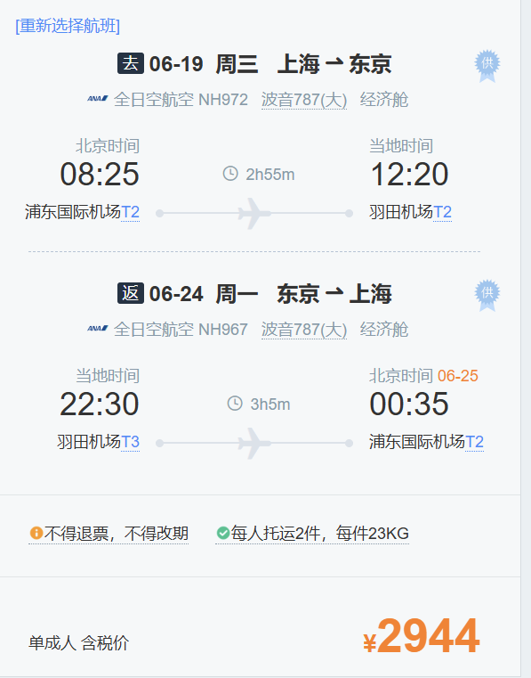
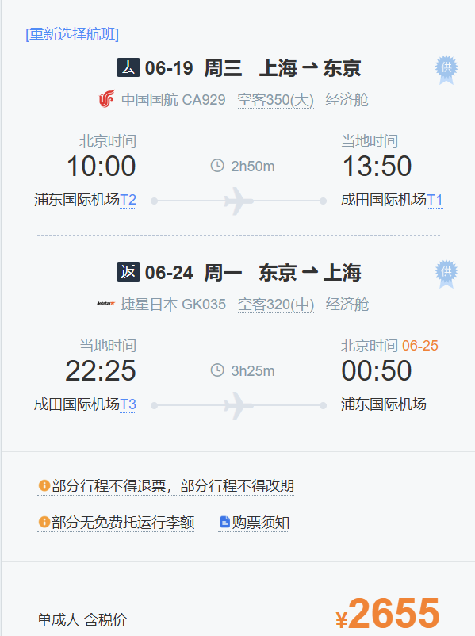
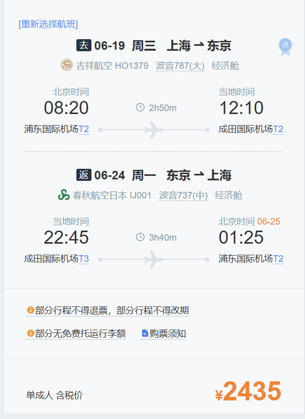
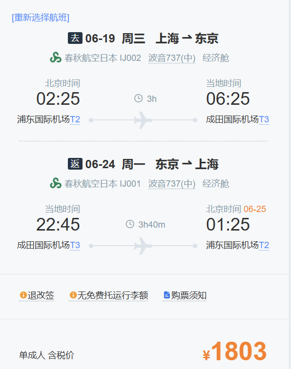

- 每日任务
  
  ✅每一周的新计划添加 [[每周计划]] 😆
- DONE 网球学费
  DEADLINE: <2024-05-22 Wed>
- TODO 日本游签证 -> 预算
	- 日本机票-> 东京版
	  collapsed:: true
		- 玩耍时间最长版本机票
			- 选择方案1
				- 优点：时间合适，行李额度高，机场合适，返程时间晚，可以多玩一天
				  缺点：价格高，去程太早
				- 6.18晚上 提前一天入住酒店附近
				- {:height 327, :width 247}
			- 选择方案2
				- 优点：价格便宜了一点
				- 缺点：机场不合适、返程没有免费额度
				- {:height 410, :width 264}
			- 选择方案3
				- 优点：价格便宜
				- 缺点：机场不合适、返程没有免费额度，去程太早
				- {:height 368, :width 267}
		- 省钱版本机票
		  collapsed:: true
			- 方案一
			  collapsed:: true
				- 优点：很省钱
				- 缺点：除了优点都是缺点（其实没有免费额度也算是变相加钱）
				  collapsed:: true
					- {:height 388, :width 251}
		- 到达机场时间合适的机票
			-
	- 日本机票 -> 大阪版
	- 大致行程路线：关东游玩 -> 19到达，休息，瞎逛，看市内景点
		- 20号，21号，镰仓、富士山各一天
		- 22号，23号，迪士尼
		- 24号，市内逛，返程
		-
- DONE 5.20买花和蛋糕
- DONE 早餐
- DONE 网球
-