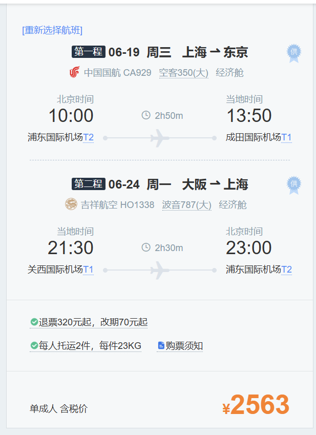

- 每日任务
  
  ✅每一周的新计划添加 [[每周计划]] 😆
	- #日本旅行
		- 行程安排大致 -> 19东京，20迪士尼，21迪士尼，22早上去大阪，22,23,24京都奈良，24晚上返程
		- 机票
			- {:height 456, :width 325}
		- TODO 交通
			- 东京内部交通流程
				- 机场到上野
					- **京成本线**：如果时间充裕，想节省车费的话，可以选择乘乘坐京成本线往返上野
			- 东京大阪交通
			- 大阪->周边交通
		- TODO 住宿
			- 东京住宿
			- 大阪住宿
			- 京都住宿
		- TODO 电话卡
			- 电话卡选购
- DONE 芒果茶
  DEADLINE: <2024-05-24 Fri>