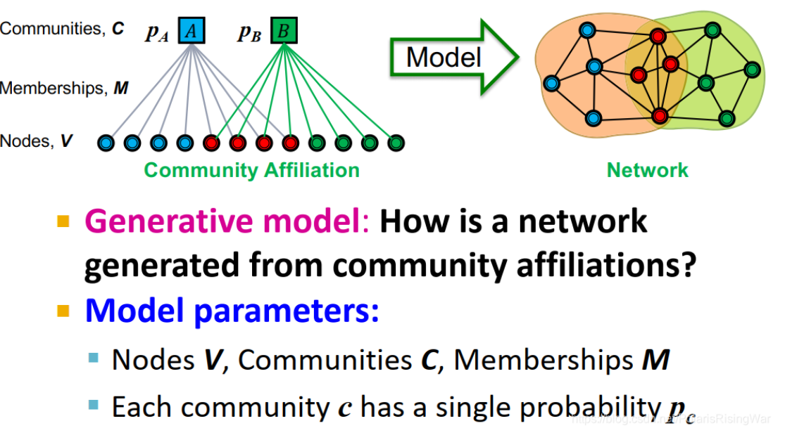
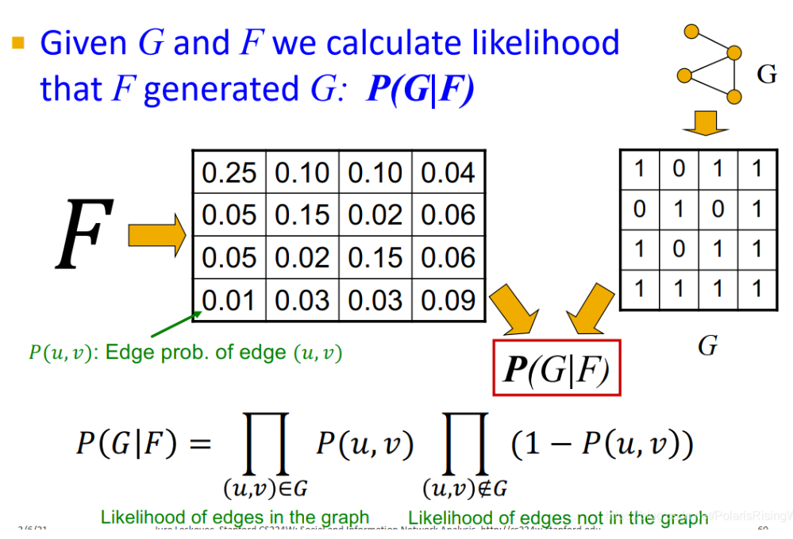

alias::  affiliation graph model

- {:height 348, :width 574}
- 参数：节点个数V ，社区个数C，社区 C 之间的节点相互连接的概率表示为 $p_{C}$，成员关系 M
  给定$V,C,M,P_{c}$，可以生成一个二分图，同时，节点之间的连接概率取决于$p_{C}$，如果一对节点同时属于两个社区，那么他们之间连接的概率是$p(u,v)=1-\prod_{c\in M_{u}\cap M_{v}}(1-p_{c})$
  > 如果同时属于两个社区，那么他们之间不连接的概率就是$\prod_{c\in M_{u}\cap M_{v}}(1-p_{c})$，所以连接的概率就是$1-\prod_{c\in M_{u}\cap M_{v}}(1-p_{c})$
- 优化目标：
  最大化$P\left(G\left|F\right.\right)=\prod_{\left(u,v\right)\in G}P\left(u,v\right)\prod_{\left(u,v\right)\notin G}\left(1-P\left(u,v\right)\right)$
  
  相当于：如果图中确实有这个边，那么你生成的图中这条边存在的概$\left(P\left(u,v\right)\right)$应该大，如果图中确实没有这个边，那么你生成的图中这条边不存在的概率$(1-P\left(u,v\right))$应该大
-
-