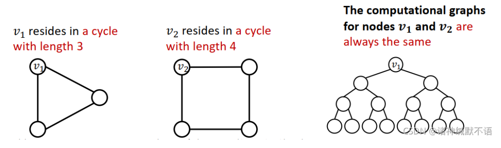
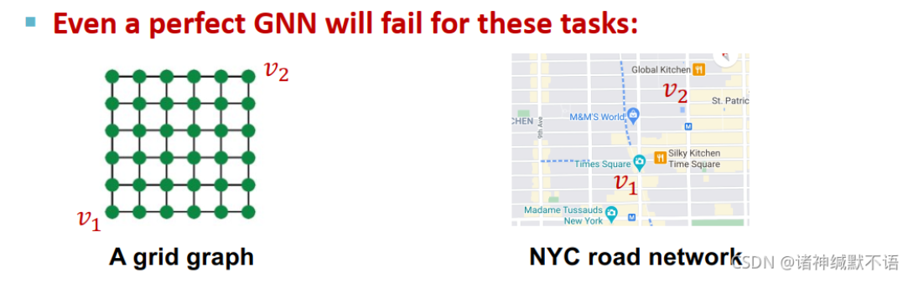

- [Advanced Topics on GNNs笔记](https://blog.csdn.net/PolarisRisingWar/article/details/120410245)
	- 本章大纲
		- 先前GNN模型存在的限制
		  collapsed:: true
			- 我们在 [[Theory of Graph Neural Networks]]中讨论了，如果 [[computational graph]]相同的节点，我们是无法区分他们的节点嵌入的，这就是**第一个问题**所在，如果两个结构不同的节点，他们具有相同计算图相同，那无法区分嵌入，如：
			  
			  **第二个问题**，就算是两个节点是对称分布的（结构上来讲，他们就应该嵌入一致），但是我希望GNN可以分辩出这两个节点在图上的不同位置，可是现在的GNN模型不行，如：
			  
		- 解决方法
		  collapsed:: true
			- 第一个问题，是在结构层面出现的问题，解决方法是 [[IDGNN]]
			- 第二个问题，是在位置层面出现的问题，解决方法是[[PGCN]]
		- GCN模型的[[鲁棒性]]
			- {{embed ((65aa4c94-a5fa-47e1-9bf0-8a4ce6533547))}}
			- 如果攻击者对于节点A感兴趣，假设节点A的真实标签是Y，攻击者可以直接改变节点A的边，如增加或减少一条边，也可以间接改变节点A的邻居的边，如增加或减少一条邻居的边，这样子的改变不容易被察觉，但是可能会改变神经网络对于节点A的预测输出
			- 可以通过一系列的实证研究得出，GCN是会被攻击所影响的，但是对于随机噪声和间接改变具有一定的鲁棒性。具体请查看[1](https://blog.csdn.net/PolarisRisingWar/article/details/120410245#:~:text=5.-,Robustness%20of%20Graph%20Neural%20Networks,-%E8%BF%91%E5%B9%B4%E6%9D%A5%EF%BC%8C%E6%B7%B1%E5%BA%A6)
-