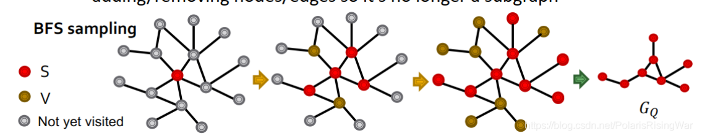

- 方法：
  \[\text{step1: 初始化 } S = \{v\}, V = \varnothing\]
  \[\text{step2: 使 } N(S) \text{ 为 } S \text{ 中节点的所有邻居。每一步抽样10\%在 } N(S) \backslash V \text{ 中的节点放入 } S \text{ 中，并将其余节点放在 } V \text{ 中。}\]
  \[\text{step3: } K \text{ 步后，获取 } G \text{ 的 induced by } S \text{ anchored  }  \text{ 的 subgraph}\]
- 示意图：
  
- 说明：
	- 大概意思就是一开始选定一个anchor节点，然后**每一步一定比例的选取它的邻居作为自己的节点，不选取的放在V中**，然后继续迭代直到K，这样子可以获取不同的子图