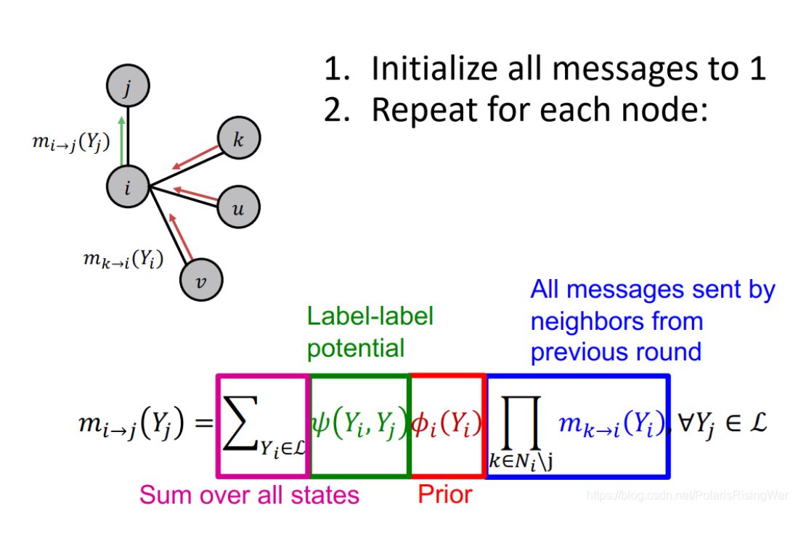
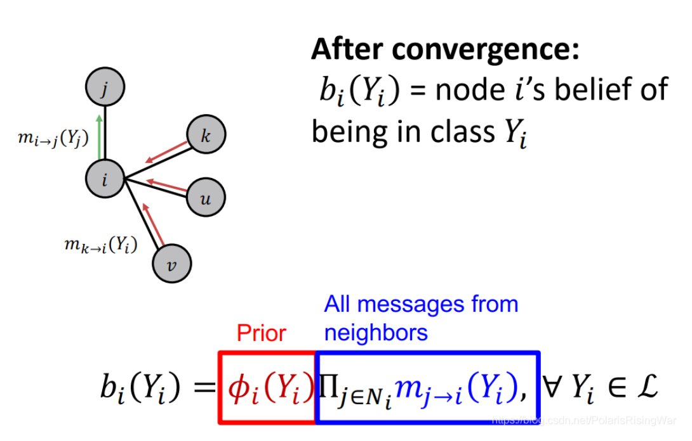

- 定义：在边上传递节点对邻居的标签概率的置信度（belief）的message/estimate，迭代计算边上的message，最终得到节点的belief。有环时可能出现问题。
- 公式
	- {:height 382, :width 480}
	  {:height 382, :width 480}
	- 其中\[m\]就是代表信息传递，第一轮迭代时候，\[i\]传递给\[j\]信息，这个信息包括后两项（红色和蓝色）和第一项（绿色）的成绩，红色和蓝色是代表\[i\]点从前一轮信息传递得来的信息，绿色是\[i\]，\[j\]之间的一个系数，这个公式就总结了信息（也就是置信度）传递的过程
	- 第二个公式就是用所包含的来自邻居的置信度再乘上自己的系数所得来的标签预测的值