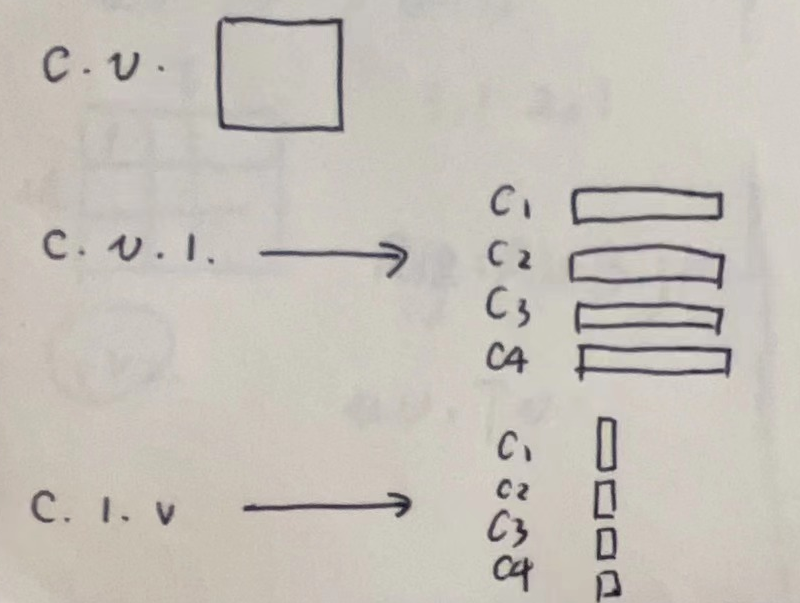

- 为每一个通道生成特征图
	- id:: 6561ddef-90e5-4ae2-ab1c-f5821a1d7e5b
	  ```
	  class CTRGC(nn.Module):#就是实现分通道图卷积并且输出了卷积的结果
	      def __init__(self, in_channels, out_channels, rel_reduction=8, mid_reduction=1):
	          super(CTRGC, self).__init__()
	          self.in_channels = in_channels
	          self.out_channels = out_channels
	          if in_channels == 3 or in_channels == 9:
	              self.rel_channels = 8
	              self.mid_channels = 16
	          else:
	              self.rel_channels = in_channels // rel_reduction
	              self.mid_channels = in_channels // mid_reduction
	          self.conv1 = nn.Conv2d(self.in_channels, self.rel_channels, kernel_size=1)
	          self.conv2 = nn.Conv2d(self.in_channels, self.rel_channels, kernel_size=1)
	          self.conv3 = nn.Conv2d(self.in_channels, self.out_channels, kernel_size=1)
	          self.conv4 = nn.Conv2d(self.rel_channels, self.out_channels, kernel_size=1)
	          self.tanh = nn.Tanh()
	          for m in self.modules():
	              if isinstance(m, nn.Conv2d):
	                  conv_init(m)
	              elif isinstance(m, nn.BatchNorm2d):
	                  bn_init(m, 1)
	  
	      def forward(self, x, A=None, alpha=1):
	          x1, x2, x3 = self.conv1(x).mean(-2), self.conv2(x).mean(-2), self.conv3(x) #x1:N,C,V ; x2:N,C,V  x3:N,C,T,V
	          x1 = self.tanh(x1.unsqueeze(-1) - x2.unsqueeze(-2))#这一步就给每一个通道生成了特征图#N,C,V,1 - N,C,1,V 广播相减
	          x1 = self.conv4(x1) * alpha + (A.unsqueeze(0).unsqueeze(0) if A is not None else 0)  # N,C,V,V
	          x1 = torch.einsum('ncuv,nctv->nctu', x1, x3)
	          return x1
	  ```
- {:height 467, :width 560}