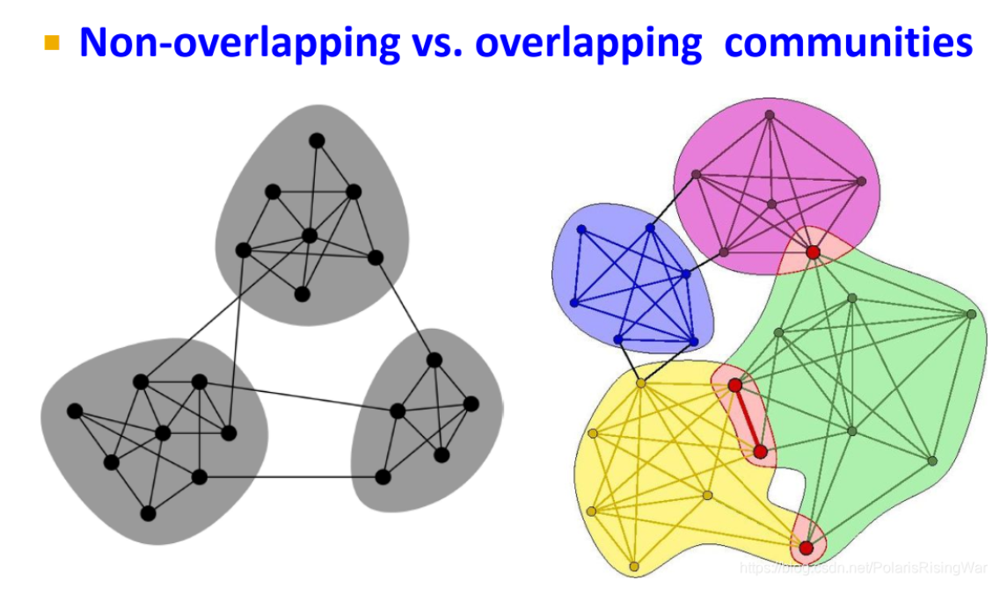

- [Community Detection in Networks笔记](https://blog.csdn.net/PolarisRisingWar/article/details/119277189)
	- 本章大纲
		- 网络中[[社区]]的概念，以及从社会学角度来证明了[网络中社区结构的存在性](((65a1f40b-9d81-4dea-a0b6-1b38b7ba28dd)))。
			- 从连接性弱的边进行分解，能够更快的分解图
		- [[模块度]]概念衡量[[社区]]识别效果。
		- [[Louvain算法]]识别网络中的community。，
		- 对于overlapping communiteis，[[BigCLAM]]进行识别。
			- 所谓的overlapping communiteis，就是指的是社区之间有重叠，没有区分的很开。
			  
-