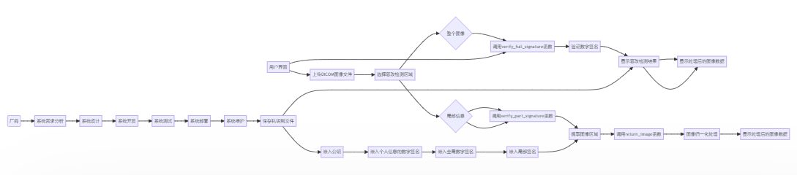
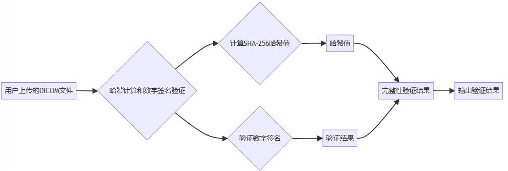

- # 1 引言
	- ## 1.1 编写目的
	  本设计书旨在描述DICOM图像篡改检测系统的总体设计和详细设计。通过该设计书，可以清楚地了解系统的功能、运行环境、设计思想、系统总体结构、基本处理流程、接口设计、性能设计及质量属性考虑以及数据库设计。
	- ## 1.2 背景
	  DICOM（医学数字成像和通信）是医学图像和相关信息的标准化格式和通信协议。在医疗领域，DICOM图像的完整性和安全性至关重要。为了保证DICOM图像的数据完整性并防止篡改，本系统旨在提供一个篡改检测功能，可以对DICOM图像进行数字签名验证，确保图像数据的可靠性和完整性。
	- ## 1.3 术语和缩略语
	- **DICOM (Digital Imaging and Communications in Medicine)**：医学数字成像和通信标准，是医学成像和相关工业的国际标准，用于存储、传输、打印和显示医学影像信息。
	- **数字签名**：一种加密技术，用于验证信息的完整性和来源。通过使用私钥对信息或其哈希进行加密，可以生成一个数字签名。接收者可以使用相应的公钥验证签名。
	- **哈希值**：一个固定长度的数值，通常由一个哈希函数根据输入数据（如文件内容）计算得出。它可以用于验证数据的完整性。
	- **公钥与私钥**：非对称加密的两个关键组成部分。私钥用于加密数据或创建数字签名，而公钥用于解密或验证签名。
	- **PKI (Public Key Infrastructure)**：公钥基础设施，一种组织和管理公钥加密的框架，包括用于生成、分发、存储、使用和撤销公钥的硬件、软件、策略和标准。
	- **SHA-256 (Secure Hash Algorithm 256-bit)**：一种加密哈希函数，输出长度为256位，常用于加密和安全应用。
	- **PSS (Probabilistic Signature Scheme)**：一种数字签名方案，提供了额外的安全性。通常与RSA加密结合使用。
	- **UI**：用户界面（User Interface）
- # 2 总体设计
	- ## 2.1 系统功能描述
	  本系统是一个DICOM图像篡改检测系统。它提供了以下功能：
	- 上传DICOM图像文件
	- 检测整个图像的数字签名是否篡改
	- 检测DICOM图像的特定部分或个人信息的数字签名是否篡改
	- 显示篡改检测的结果
	- 显示处理后的图像数据
	- **输入项目**：用户上传的DICOM文件，这是一种医学影像文件格式，包含图像数据和其他医疗信息。
	- **输出项目**：验证结果，这是一个显示图像是否被篡改的结果信息。
	- **处理的功能**：
		- 哈希计算：对DICOM图像的每个区域以及整体内容计算SHA-256哈希值，用于后续的完整性验证。
		- 数字签名验证：使用嵌入在DICOM文件中的公钥（位于DICOM标签(0x9001, 0x0001)）验证数字签名。整个图像的签名位于标签(0x9001, 0x0002)，而图像的四个区域的签名分别位于[]0x0012, 0x0064]第九个序列下。这确保了文件的来源和完整性未被篡改。
	- **性能要求**：
		- 快速的哈希计算和验证过程，确保用户在几秒内获得结果。
		- 高的安全性和加密标准，保护患者数据的隐私和完整性。
		  id:: 654e1f72-b0fb-4d07-a8bf-298fa82c214b
	- ## 2.2 运行环境
	  该系统的运行环境包括：
		- Python编程语言
		- Cryptodome库
		- OpenCV库
		- NumPy库
		- PIL库
		- pydicom库
		- Gradio库
	- ## 2.3 设计思想
	  本系统的设计思想是基于数字签名和图像处理技术。通过使用RSA算法和SHA256哈希算法进行数字签名验证，可以确保DICOM图像的完整性和真实性。同时，利用OpenCV和PIL库进行图像处理，包括图像归一化、像素数据提取等操作。
	- ## 2.4 系统总体结构
		- 系统总体结构如下：
		- 
		- 用户界面：通过Gradio库构建用户界面，实现DICOM图像的上传和篡改检测操作。
		- 篡改检测模块：包括整个图像篡改检测和局部信息篡改检测两个功能模块。使用RSA算法和SHA256哈希算法进行数字签名验证，判断图像是否篡改。
		- 图像处理模块：利用OpenCV和PIL库进行图像处理，包括图像归一化、像素数据提取等操作。
		- 结果展示模块：将篡改检测的结果和处理后的图像数据展示给用户。
	- ## 2.5 基本处理流程
	  基本处理流程如下：
	  1. 用户通过用户界面上传DICOM图像文件。
	  2. 用户选择篡改检测区域（整个图像或特定部分/个人信息）。
	  3. 系统根据用户选择的区域调用相应的篡改检测函数。
	  4. 篡改检测函数使用RSA算法和SHA256哈希算法验证数字签名，判断图像是否篡改。
	  5. 如果是整个图像的篡改检测，系统会进行图像归一化处理并显示处理后的图像数据。
	  6. 如果是局部信息的篡改检测，系统会提取相应的图像区域，并进行图像归一化处理并显示处理后的图像数据。
	  7. 系统将篡改检测结果和处理后的图像数据展示给用户。
	- **数据流程图**
		- 
- # 3 接口设计
	- ## 3.1 外部接口
		- <!--[if !supportLists]-->**· **<!--[endif]-->**用户界面：**通过Gradio库构建用户界面，提供上传DICOM文件的输入框和显示结果的文本框，以及选择篡改检测区域的下拉选择框。
		- <!--[if !supportLists]-->**· **<!--[endif]-->**计算资源**：系统需要处理器支持高速的哈希计算和数字签名验证。
		- <!--[if !supportLists]-->**· **<!--[endif]-->**存储资源**：需要足够的存储空间来保存DICOM文件及其加密版本。
	- ## 3.2 内部接口
		- get_public_key: 从DICOM文件中获取公钥。
		- verify_full_signature: 验证整个DICOM图像的数字签名是否篡改。
		- return_image: 返回处理后的图像数据。
		- verify_part_signature: 验证DICOM图像的特定部分或个人信息的数字签名是否篡改。
- # 4 性能设计及质量属性考虑
	- 性能设计：系统需要快速响应用户的上传和篡改检测请求，因此需要优化算法和数据处理流程，以提高系统的处理速度和效率。
	- 质量属性考虑：系统需要保证篡改检测的准确性和可靠性，确保图像数据的完整性和真实性。同时，界面设计应简洁、直观，提供友好的用户体验。
		- **处理速度**：系统的设计目标是快速处理文件，能够在几秒钟内完成哈希运算和签名验证。
		- **数据保护**：系统采用RSA和SHA-256算法，以确保数据的安全性和防篡改性。
		- **用户友好性**：系统提供了简洁的用户界面，使得即使是非技术用户也能轻松使用。
		- **易于维护**：代码结构明晰，使得系统的维护和升级变得简单易行。
- # 5 数据库设计
  本系统不涉及数据库设计，因为它主要是一个图像篡改检测系统，不需要对数据进行持久化存储。系统运行时所需的数据将在内存中进行处理和存储，并在界面上展示给用户。