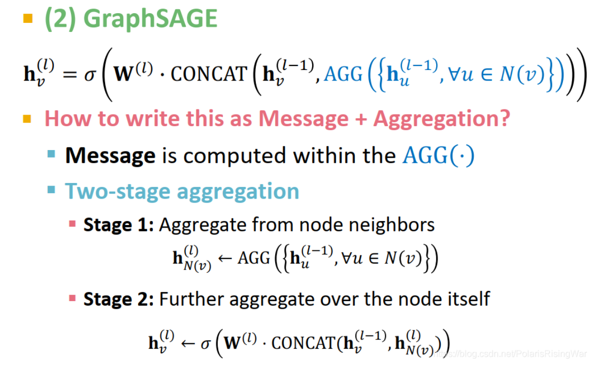

- [Design Space笔记1](https://blog.csdn.net/PolarisRisingWar/article/details/117989170)
  [Design Space笔记2](https://blog.csdn.net/PolarisRisingWar/article/details/118001121)
	- 本章大纲
		- [[GNN]]单层的结构
		  id:: 65992c7b-f387-42ae-bcaf-ccdffbadb580
		  collapsed:: true
			- {{embed ((6598fec4-bcb4-4887-957e-fc5f33d04060))}}
			- 举例：
				- 对于最基本的GNN而言
				  $$\mathbf{h_v}^{(l)} = \sigma \left( \sum_{u\in\mathcal{N}(v)}\frac{1}{|\mathcal{N}(v)|} \mathbf{W}^{(l)} \mathbf{h}_u^{(l-1)} \right)$$
				  其中$$\sum_{u\in\mathcal{N}(v)}$$是信息聚合，$$\frac{1}{|\mathcal{N}(v)|} \mathbf{W}^{(l)} \mathbf{h}_u^{(l-1)}$$是信息转换
				- [[GraphSAGE]]的Design Space举例
					- {:height 300, :width 432}
				- [[GAT 图注意力机制]]
		- [[GNN]]多层堆叠方式
		  collapsed:: true
			- {{embed ((65992c9d-668b-4baa-b258-36701fc371dc))}}
		- [[图深度学习]]中的数据增强
		  collapsed:: true
			- {{embed [[图增强]]}}
		- [[图深度学习]]的通用结构
			- {{embed ((659a4c68-4c5e-4ba0-afec-718de154bdc5))}}
-
-