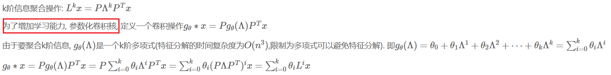

- 相关网址
	- [Chebyshev多项式作为GCN卷积核 ](https://zhuanlan.zhihu.com/p/106687580)
	- [如何理解 Graph Convolutional Network](https://www.zhihu.com/question/54504471/answer/332657604)
	- [图卷积:从谱域卷积到切比雪夫网络再到GCN](https://www.cnblogs.com/flyablecoder/p/16166223.html) 最清晰的解释，从坐标变换的角度介绍了为什么要用拉普拉斯矩阵和正交对角化
	- [Graph Neural Networks (GNN)（二）：Spectral-GNN 引言和导入-CSDN博客](https://blog.csdn.net/weixin_37589575/article/details/106709405)
	- [Graph Neural Networks (GNN)（三）：Spectral-GNN 之 GCN_gcn.circulas-CSDN博客](https://blog.csdn.net/weixin_37589575/article/details/107013739)
- 
  通过直接设计频域的卷积核，来实现更丰富的关系表现，传统的拉普拉斯矩阵聚合，也可以体现类似于物理热传导中的聚合关系[1](https://blog.csdn.net/weixin_37589575/article/details/106709405#:~:text=2.-,%E5%BC%95%E5%85%A5%20%E2%80%93%20%E7%83%AD%E4%BC%A0%E5%AF%BC,-%E4%BC%97%E6%89%80%E5%91%A8%E7%9F%A5%EF%BC%8C%E6%B2%A1%E6%9C%89%E5%A4%96%E6%8E%A5)，但是为了体现更丰富的关系，设计频域卷积核