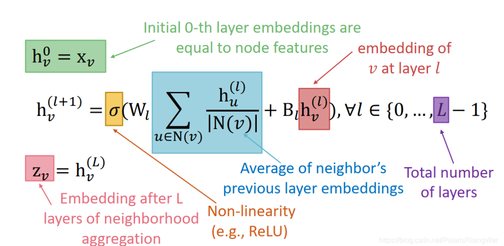
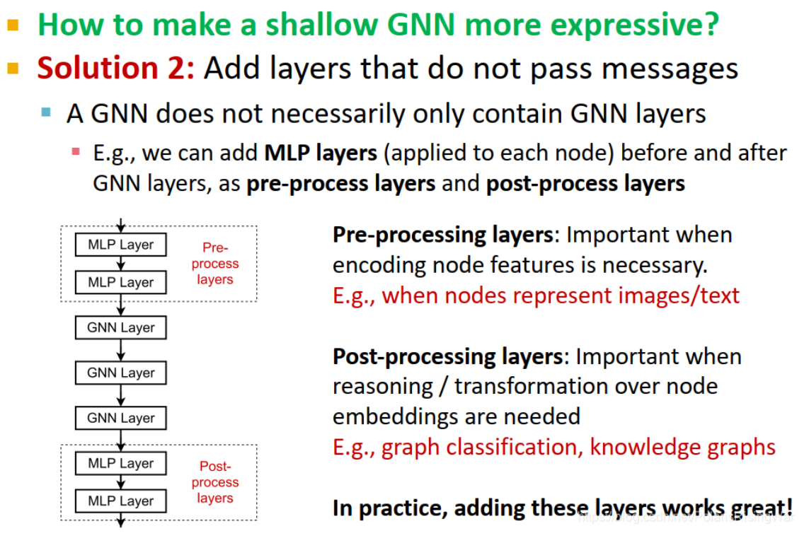
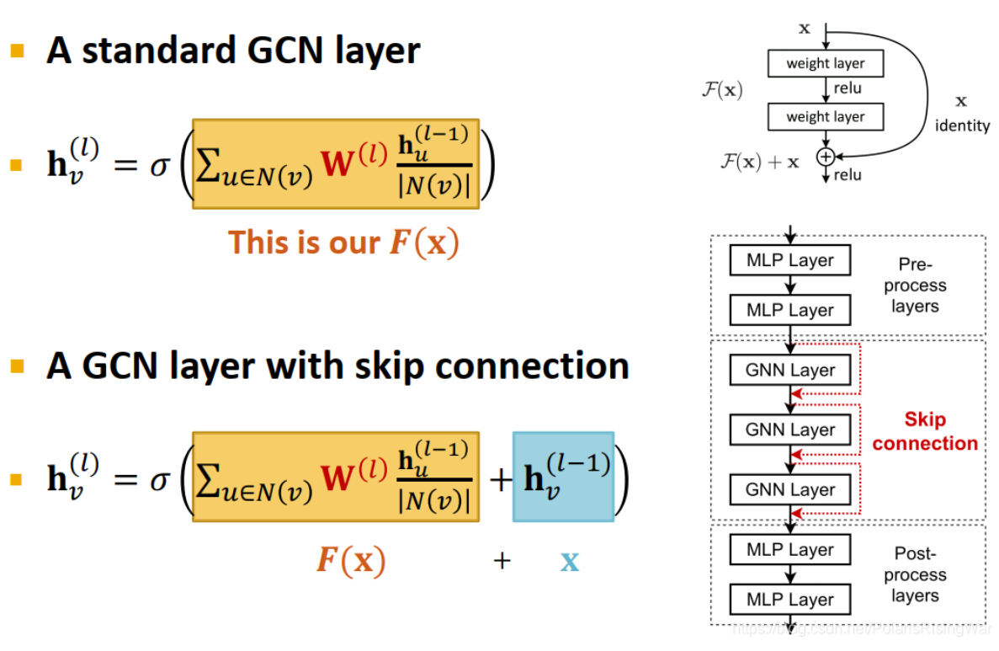

- 定义：通过聚合邻居来**生成节点嵌入**，注意，**目的是生成节点嵌入**
  id:: 6598fec4-bcb4-4887-957e-fc5f33d04060
	- 一层GNN包含**信息转换**和**信息聚合**两个部分，对每个节点，先计算出其自身与邻居的节点信息，然后计算其邻居与本身的信息聚合。
	  id:: 65992cc8-98ab-499d-994e-bc9c02a7aa79
		- 信息转换：用每个节点产生一个信息，传播到其他节点上
		  $$m_u^{(l)}​=W_{(l)}h_u^{(l−1)}​$$
		  $$\mathbf{m}_v^{(l)} = \mathbf{B}^{(l)} \mathbf{h}_v^{(l-1)}$$
		- 信息聚合：对每个节点，聚合其邻居的节点信息和自身的信息
		  $$\mathbf{h}_v^{(l)} = \operatorname{CONCAT}(AGG^{(l)}(\{\mathbf{m}_u^{(l)}, u \in N(v)\}), \mathbf{m}_v^{(l)})$$注意其中的AGG代表的是聚合函数，可以有多种选择，如求和、求平均，求极大值
- 思想：
	- 聚合邻居信息。每一层都产生一种节点嵌入。将上一层的邻居信息聚合起来，连接本节点上一层信息，产生新的节点嵌入。第一层节点嵌入就是节点自身特征。
- 公式：
	- {:height 310, :width 573}
	- 不难看出，每一层是两个步骤：
		- 聚合邻居和自身信息
		- 生产新的一层的嵌入如\[h_v^{(l)},h_v^{(l+1)}\]
- 过平滑：
  id:: 65992c9d-668b-4baa-b258-36701fc371dc
	- 如果层数过多，很容易出现过平滑的问题
		- 感受野内的节点重合过多，导致嵌入也类似，最后节点特征基本上一样。对K层GNN，每个节点都有一个K跳邻居的感受野。K越大，感受野越大
		- 堆叠很多GNN网络层→节点具有高度重合的感受野→节点嵌入高度相似→过平滑问题
	- 解决：
		- 第一步：分析解决问题所需的必要感受野（如测量图的[直径](https://blog.csdn.net/PolarisRisingWar/article/details/117989170#fn7)）
		  第二步：设置GNN层数 L 略大于我们想要的感受野
		- 使一个浅的GNN网络更具有表现力（使用深度学习的方法）
			- 增加单层GNN的表现力，如将信息转换/信息聚合过程从一个简单的线性网络变成深度神经网络（如3层MLP）
			- 添加不是用来传递信息的网络层，也就是非GNN层，如对每个节点应用MLP（在GNN层之前或之后均可，分别叫 pre-process layers 和 post-process layers）
				- pre-processing layers：如果节点特征必须经过编码就很重要（如节点表示图像/文字时）
				  post-processing layers：如果在节点嵌入的基础上需要进行推理和转换就很重要（如**图分类**、知识图谱等任务中）
				  {:height 456, :width 585}
		- 使用skip connection
			- {:height 456, :width 585}
		- {:height 184, :width 352}
-