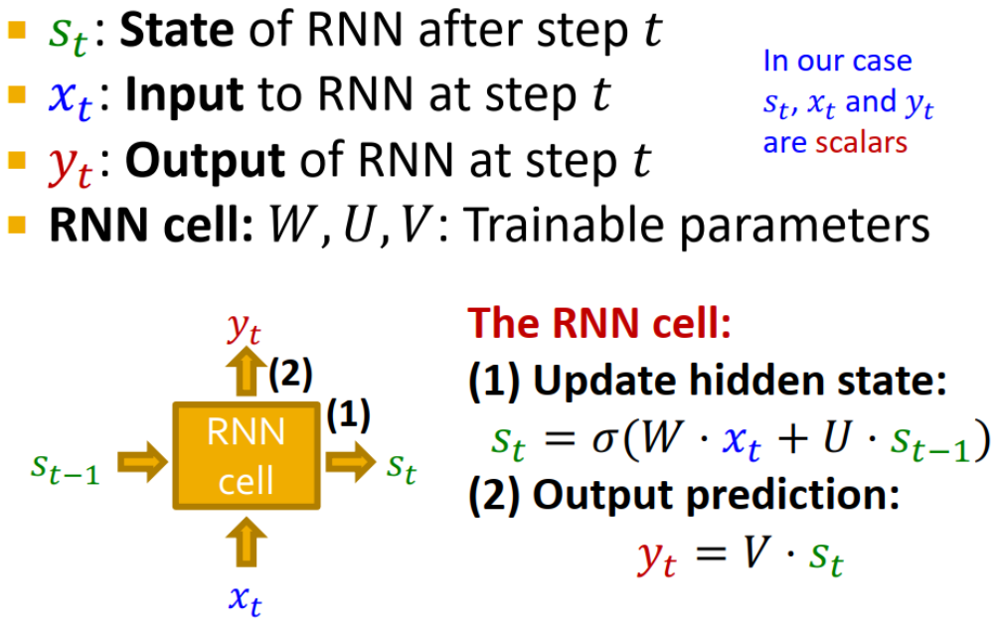
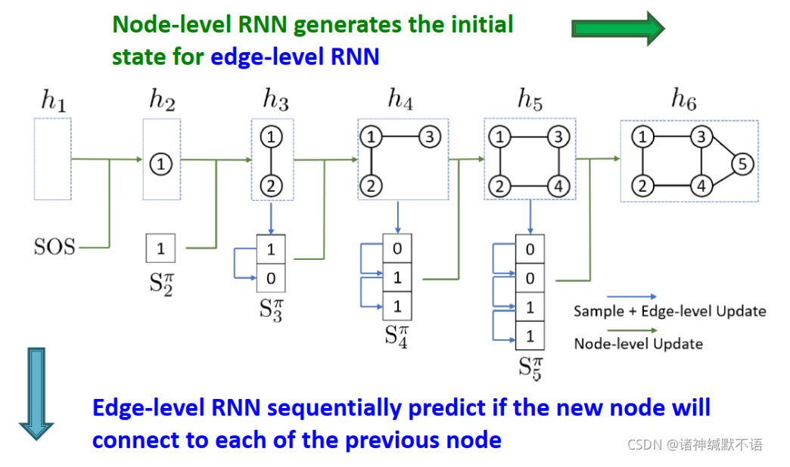

- 本页只记录了基本思想，详细请看[1](https://blog.csdn.net/PolarisRisingWar/article/details/120357007#:~:text=3.-,GraphRNN%3A%20Generating%20Realistic%20Graphs,-GraphRNN%E7%9A%84%E4%BC%98%E7%82%B9)
- 思想：将图建模为序列，在邻接矩阵中依次添加节点和边，是一个序列生成问题。
- 步骤：
	- (1) 生成一个新节点的状态（节点级别序列）
	  (2) 根据新节点状态生成它与之前节点相连的边（边级别序列）
	  
- 建模：GraphRNN有**一个节点级别RNN**和**一个边级别RNN**，节点级别RNN生成边级别RNN的初始state，边级别RNN sequentially预测这个新节点与每一个之前的节点是否相连。
  
	-
	-