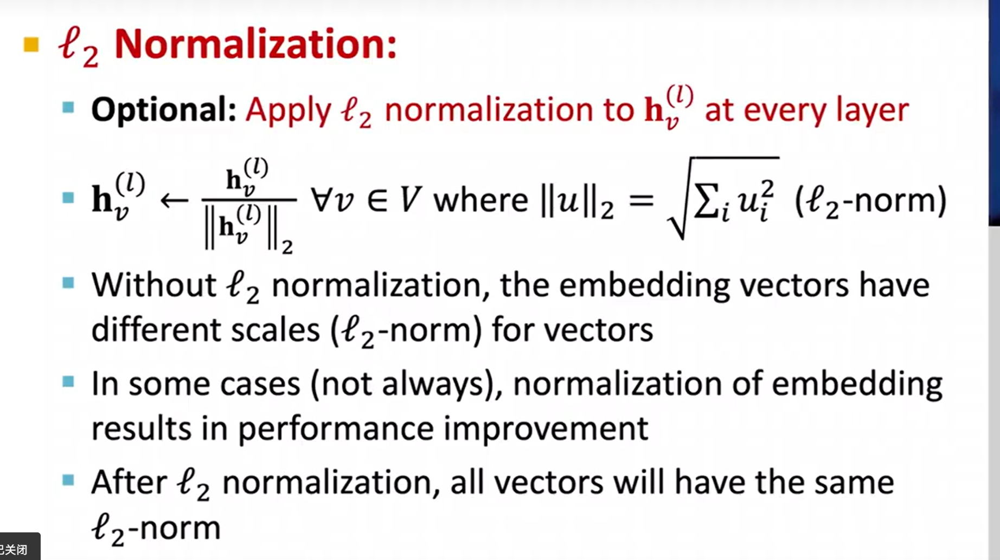

- 和GNN的区别在于GraphSAGE采用了更有弹性的聚合函数，可以选用mean、pooling、LSTM等聚合操作
  
  $$\mathrm{AGG} = \frac{1}{|\mathcal{N}(v)|} \sum_{u\in\mathcal{N}(v)} \mathbf{h}_u^{(l-1)}$$
  $$\mathrm{AGG} = \mathrm{Mean} \left(\left\{\mathrm{MLP}(\mathbf{h}_u^{(l-1)}), \forall u\in\mathcal{N}(v)\right\}\right)$$
  $$\mathrm{AGG} = \mathrm{LSTM} \left([\mathbf{h}_u^{(l-1)}, \forall u\in\pi(\mathcal{N}(v))]\right)$$
- 同时，GraphSAGE在每一层特征中都加入了L2范数操作
	- {:height 424, :width 571}
	- 此处相当于对得到的特征进行归一化处理，让最后得到的特征中的长度为1