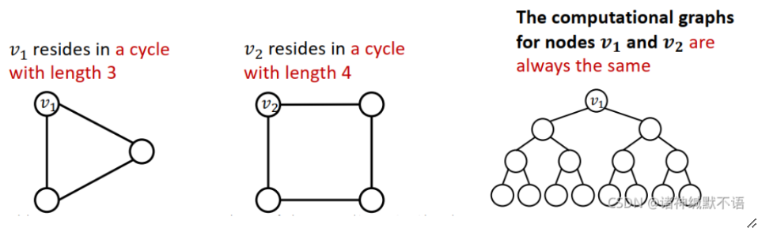
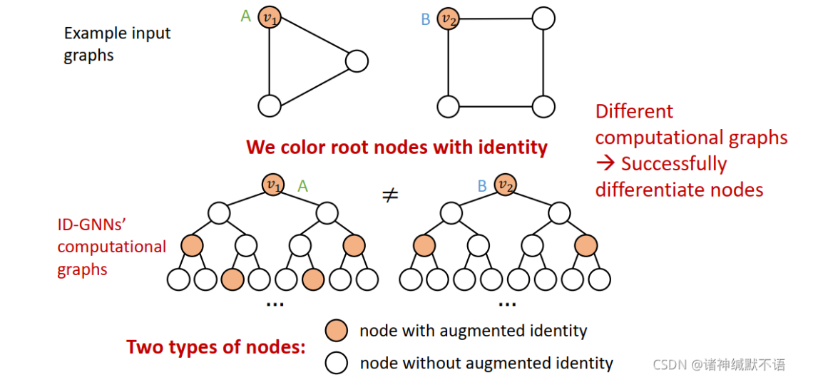
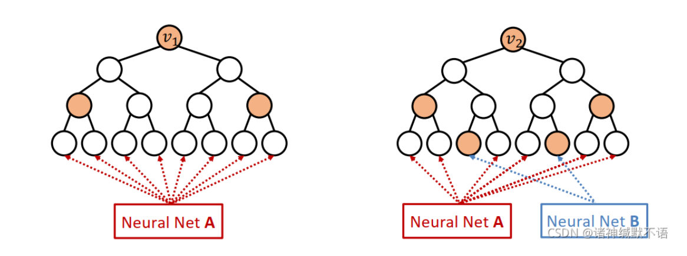
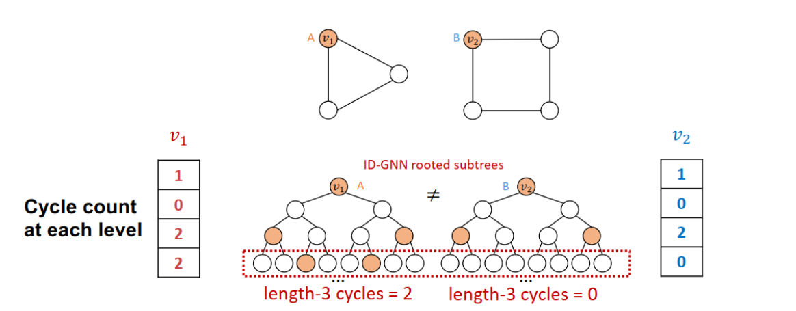

- 定义：用于解决结构不同但计算图相同导致的节点嵌入相同的问题
  如GNN无法区分$v_1，v_2$
  
- 方法：
	- 对想要嵌入的节点分配颜色，也就是分配一个标记，还是以上图为例，此时计算图变为了：
	  
	  这个方法的优点，可以计算circle的个数，我理解的circle个数，指的是$V$有多少一阶领居节点相互连接，这些可以在计算图的第四层反应出来，计算图的第二层是一阶邻居，第三层是一阶邻居的邻居（其中必定包含根节点，如果另外一个节点是根节点的邻居节点，那么第四层中必定会再次出现根节点，反之就不会。），可以在第四层中根节点再次出现的个数来反应$V$有多少一阶领居节点相互连接（2倍关系）
- 如何在图上运行
	- 类似于针对 [[heterogeneous graph]]的 [[RGCN]]方法，对于被颜色标记的点，使用一组神经网络，不是被颜色标记的组，用另一套神经网络，如图所示：
	  
	  白色的用A神经网络，黄色的用B神经网络，上图举了两个例子来说明
- 简化版本：
	- 直接将每一层的信息当做节点嵌入增强到原节点嵌入中，就不用再进行异质图计算了，如图所示：
	  
	- 可以用主流的PyG等库来应用 IDGNN
-