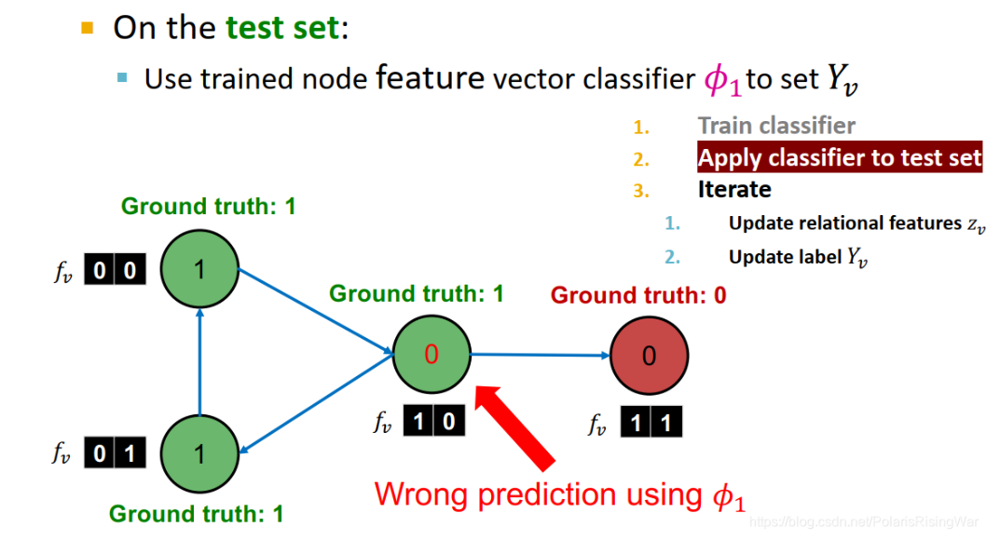
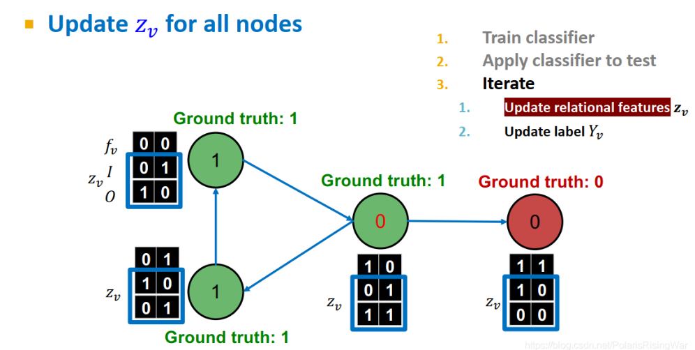
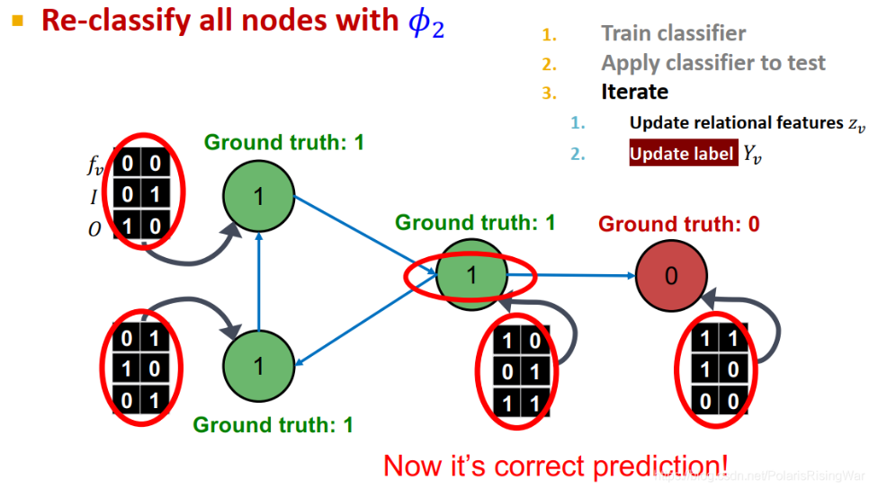
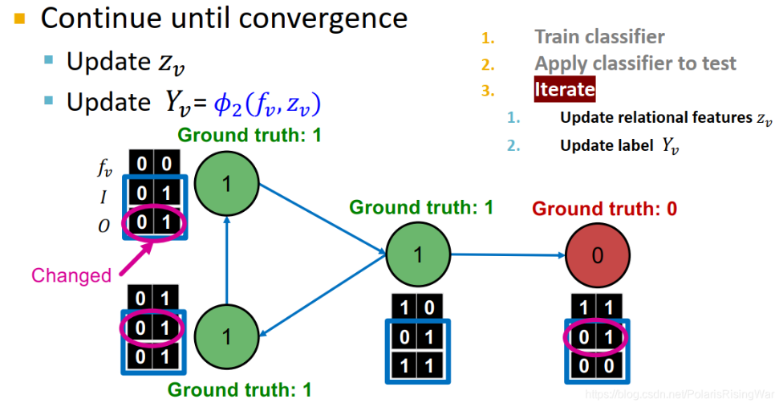

- 定义：在训练集（**这里的训练集是全部有标签的**）上训练两种分类器
	- 一种是$$\phi_1$$，使用**节点特征**预测节点标签：$$\phi_1(f_v) = Y_v$$
	- 一种是$$\phi_2$$，使用**节点特征和领居标签的集合特征**$$z_v$$预测节点特征，$$\phi_2(f_v,z_v) = Y_v$$
		- 其中\[z_v\]的定义很灵活，可以是邻居标签的各标签数目或比例，邻居标签中出现次数最多的标签，邻居标签的类数
- 过程：
	- 首先在训练集上训练好分类器
	- 然后在测试集上，一部分节点没有标签（但是有节点特征）
		- 用\[\phi_1\]对没有标签的节点进行预测上标签
		- \[\phi_2\]再进行迭代更新，直到收敛
- 举例：
	- 现在已经训练好了\[\phi_1,\phi_2\]
	- {:height 339, :width 541}
	  {:height 339, :width 541}
	  {:height 339, :width 541}
	  {:height 339, :width 541}