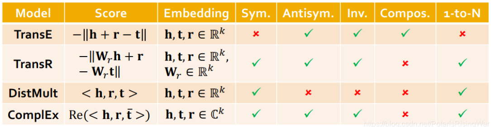

- [Knowledeg Graph Embeddings笔记](https://blog.csdn.net/PolarisRisingWar/article/details/118398869)
	- 本章大纲
		- [[heterogeneous graph]] 介绍和针对异质图的[[RGCN]]的方法
		- [[Knowledge Graphs]]的定义和针对Knowledge Graphs的图深度网络算法[[TransE]]、 [[TransR]]、[[DisMult]]、[[ComplEx]]
			- 几种方法的比较
			  id:: 659bfc2d-4d0f-426f-a9fa-0e0aed483894
			  
		- 知识图谱嵌入问题的实践应用
			- 不同知识图谱可能会有很不同的关系模式
			- 因此没有适合所有KG的嵌入方法，可用上表来辅助选择
			- 可以**先试用TransE**来迅速获得结果（如果目标KG没有过多symmetric relations的话）
			- 然后再用更有表示能力的模型，如ComplEx或[RotatE](https://blog.csdn.net/PolarisRisingWar/article/details/118398869#fn22)（复数域的TransE）等