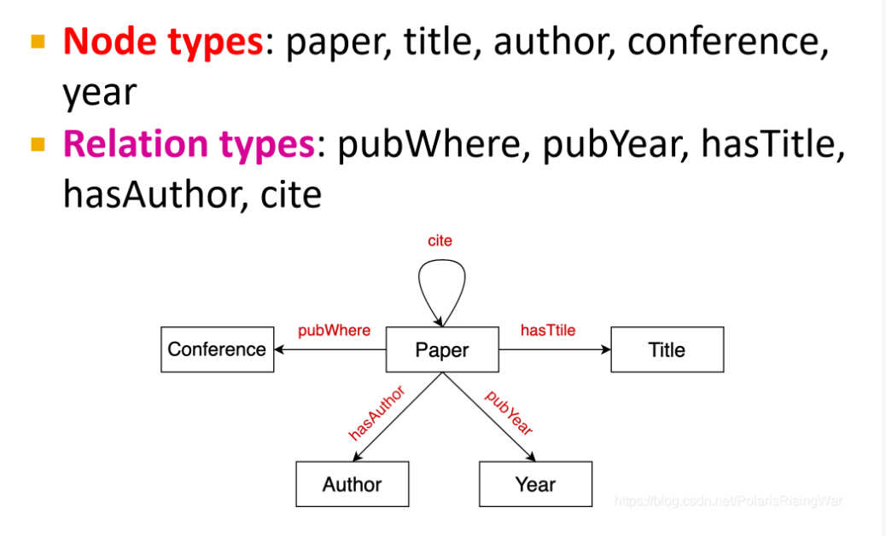

- 定义：以图形式呈现的知识，捕获实体entity（节点）、类型（节点标签）、关系relationship（边）
  一种 [[heterogeneous graph]] 实例
- 举例：
  
- 建模算法：
  id:: 659bf5fb-8e6f-4023-9f03-eef0451d3af6
	- 边被表示为三元组的形式：\( (h, r, t) \) ，其中 \(h\) 表示头实体，\(r\) 表示关系，\(t\) 表示尾实体，将实体和边表示到嵌入域/表示域（\(\mathbb{R}^d\)）中，给出一个真实的三元组 \( (h, r, t) \)，**目标是对** \( (h, r) \) **的嵌入应靠近** \(t\) **的嵌入。**
		- [[TransE]]
-
-