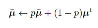

- 获得更好的学习率方法？ #深度学习初步 #card
  card-last-interval:: 11.2
  card-repeats:: 3
  card-ease-factor:: 2.8
  card-next-schedule:: 2024-01-31T08:43:23.519Z
  card-last-reviewed:: 2024-01-20T04:43:23.520Z
  card-last-score:: 5
	- 预热
	- 学习率下降
- 测试的时候 批量归一化是如何实现的？  #深度学习初步 #card
  card-last-interval:: 11.2
  card-repeats:: 3
  card-ease-factor:: 2.8
  card-next-schedule:: 2024-01-31T08:44:39.981Z
  card-last-reviewed:: 2024-01-20T04:44:39.981Z
  card-last-score:: 5
	- 
	- {{embed ((655bf85b-a553-4d89-806e-9611fa9cd490))}}
-
-