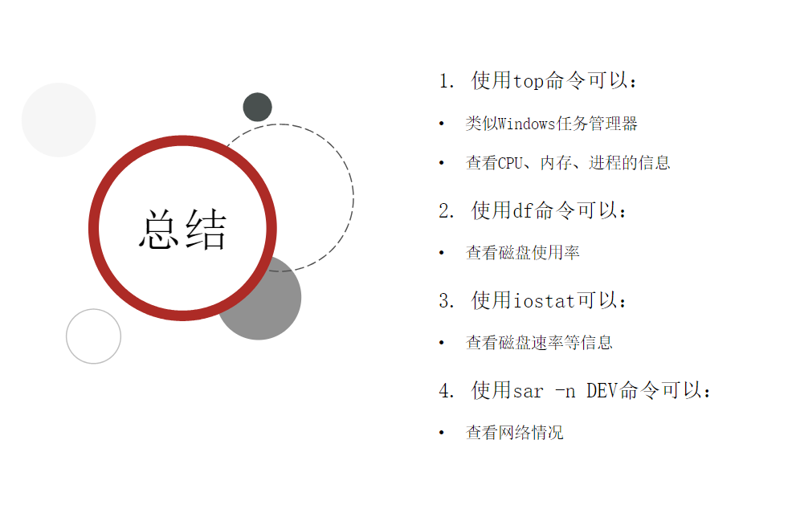
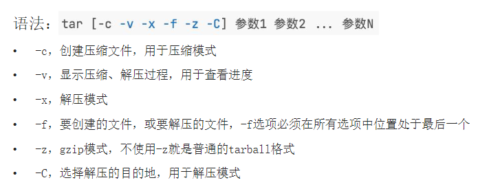

- 
- ## Linux 和ctrl相关的命令
	- 查看历史？ #card
	  card-last-interval:: 4
	  card-repeats:: 2
	  card-ease-factor:: 2.7
	  card-next-schedule:: 2024-01-02T08:31:15.573Z
	  card-last-reviewed:: 2023-12-29T08:31:15.574Z
	  card-last-score:: 5
		- !命令前缀，自动匹配上一个命令
		- ctrl + r，搜索历史命令
		- history 查看所有历史
	- 光标移动？ #card
	  card-last-interval:: 4
	  card-repeats:: 2
	  card-ease-factor:: 2.46
	  card-next-schedule:: 2024-01-02T08:27:50.325Z
	  card-last-reviewed:: 2023-12-29T08:27:50.326Z
	  card-last-score:: 5
		- ctrl+a移动到开头
		- ctrl+e移动末尾
	- 清屏 #card
	  card-last-interval:: 4
	  card-repeats:: 2
	  card-ease-factor:: 2.7
	  card-next-schedule:: 2024-01-02T08:31:27.076Z
	  card-last-reviewed:: 2023-12-29T08:31:27.076Z
	  card-last-score:: 5
		- ctrl + l
- ## Linux命令安装软件
	- 使用apt命令进行联网管理 #card
	  card-last-interval:: 4
	  card-repeats:: 2
	  card-ease-factor:: 2.7
	  card-next-schedule:: 2024-01-02T08:30:29.466Z
	  card-last-reviewed:: 2023-12-29T08:30:29.467Z
	  card-last-score:: 5
		- `apt [-y] [install | remove | search ]`
- ## Linux systemctl 命令
	- ((65791e23-93ba-4308-ae29-b7a24cf01484))
	- 可以控制软件（服务）的启动、关闭、开机自启动
		- 系统内置服务均可被systemctl控制
		- 第三方软件，如果自动注册了可以被systemctl控制
		- 第三方软件，如果没有自动注册，可以手动注册（后续学习）
- ## Linux软链接
	- 软链接命令？ #card
	  card-last-interval:: 4
	  card-repeats:: 2
	  card-ease-factor:: 2.7
	  card-next-schedule:: 2024-01-02T08:29:45.766Z
	  card-last-reviewed:: 2023-12-29T08:29:45.766Z
	  card-last-score:: 5
		- `ln -s 要链接的原地址（文件夹\文件） 链接地址地址`
- ## Linux时间操作
	- 查看时间、以一定格式查看时间，修改Linux时区
	- ((65791fab-94fd-4ace-8625-218dd01e45e2))
	- ((65791fb1-cb2f-4e2a-b290-453f8cab0d34))
- ## 关于IP、域名和域名解析的知识
	- 域名是什么？IP是什么？域名解析的流程什么？#card
	  card-last-interval:: 4
	  card-repeats:: 2
	  card-ease-factor:: 2.7
	  card-next-schedule:: 2024-01-02T08:31:28.196Z
	  card-last-reviewed:: 2023-12-29T08:31:28.197Z
	  card-last-score:: 5
		- 就是名字，比如我自己电脑的hmh，或者百度的www.baidu.com
		- 每一个电脑都有自己独特的IP
			- 一般是IPV4
		- 域名解析
			- 先查找本地的域名->IP对应关系
			- 找不到再去公开的DNS上找
	- 白名单IP一般是？本机IP是？ #card
	  card-last-interval:: 4
	  card-repeats:: 2
	  card-ease-factor:: 2.7
	  card-next-schedule:: 2024-01-02T08:30:30.728Z
	  card-last-reviewed:: 2023-12-29T08:30:30.728Z
	  card-last-score:: 5
		- 本地回环IP，表示本机127.0.0.1。
		- 白名单中表示任意IP,也可表示本机：0.0.0.0
		  id:: 657921b1-6c46-4986-9e9a-e6afc5465070
- ## 关于 ping wget curl命令
	- ping命令的格式？#card
	  card-last-interval:: 12.85
	  card-repeats:: 2
	  card-ease-factor:: 2.6
	  card-next-schedule:: 2024-01-11T04:27:39.484Z
	  card-last-reviewed:: 2023-12-29T08:27:39.484Z
	  card-last-score:: 5
		- `ping [-c num] ip或主机名`
		- -c表示测试的次数，如果没有的话会一直循环
	- wget命令的格式？ #card
	  card-last-interval:: 4
	  card-repeats:: 2
	  card-ease-factor:: 2.46
	  card-next-schedule:: 2024-01-02T08:29:22.616Z
	  card-last-reviewed:: 2023-12-29T08:29:22.616Z
	  card-last-score:: 5
		- `wget [-b] url`
		- [-b]表示是否采用后台下载并且输出到wget.log文件中
		- 如何跟踪wget.log?
	- curl 命令的格式？ #card
	  card-last-interval:: 4
	  card-repeats:: 2
	  card-ease-factor:: 2.7
	  card-next-schedule:: 2024-01-02T08:31:24.784Z
	  card-last-reviewed:: 2023-12-29T08:31:24.784Z
	  card-last-score:: 5
		- `curl [-0] url`
		- curl是网络请求命令
			- 使用-0表示下载url的文件
	- 虚拟端口是什么，分为哪三类？#card
	  card-last-interval:: 4
	  card-repeats:: 2
	  card-ease-factor:: 2.7
	  card-next-schedule:: 2024-01-02T08:30:21.417Z
	  card-last-reviewed:: 2023-12-29T08:30:21.417Z
	  card-last-score:: 5
		- 虚拟端口：操作系统和外部交互的出入口
		- 端口的划分
			- 公认端口：1~1023，用于系统内置或常用知名软件绑定使用
			- 注册端口：1024~49151，用于松散绑定使用（用户自定义）
			- 动态端口：49152~65535，用于临时使用（多用于出口）
- ## Linux进程
	- 如何查看进程，如何过滤特定的进程？ #card
	  card-last-interval:: 4
	  card-repeats:: 2
	  card-ease-factor:: 2.46
	  card-next-schedule:: 2024-01-02T08:28:57.038Z
	  card-last-reviewed:: 2023-12-29T08:28:57.039Z
	  card-last-score:: 5
		- 查看进程:
			- `ps -ef`
		- 过滤特定的进程
			- `ps -ef | grep [name]`
	- 如何关闭进程？ #card
	  card-last-interval:: 4
	  card-repeats:: 2
	  card-ease-factor:: 2.7
	  card-next-schedule:: 2024-01-02T08:29:49.033Z
	  card-last-reviewed:: 2023-12-29T08:29:49.033Z
	  card-last-score:: 5
		- `kill [-9] [ID]`
			- -9代表强制执行关闭，但是否关闭看进程自身的处理机制。
- ## Linux 系统状态查询
	- top 可以进行 {{cloze 交互式查询}}，df是用于 {{cloze 查询磁盘使用率}}，iostat是用于 {{cloze 查看磁盘速率}} #card
	  card-last-interval:: 4
	  card-repeats:: 2
	  card-ease-factor:: 2.46
	  card-next-schedule:: 2024-01-02T08:27:46.776Z
	  card-last-reviewed:: 2023-12-29T08:27:46.776Z
	  card-last-score:: 5
	- {:height 388, :width 594}
- ## Linux 环境变量
	- 查看系统环境的命令是 {{cloze `env`}}，查看PATH的操作是 {{cloze  env | grep PATH}} #card
	  card-last-interval:: 4
	  card-repeats:: 2
	  card-ease-factor:: 2.7
	  card-next-schedule:: 2024-01-02T08:30:28.106Z
	  card-last-reviewed:: 2023-12-29T08:30:28.106Z
	  card-last-score:: 5
	- $的作用是？ $PATH的作用是？PATH记录了什么？ #card
	  card-last-interval:: 4
	  card-repeats:: 2
	  card-ease-factor:: 2.7
	  card-next-schedule:: 2024-01-02T08:30:19.998Z
	  card-last-reviewed:: 2023-12-29T08:30:19.998Z
	  card-last-score:: 5
		- $就是获取当前变量值的意思
		- $PATH 就是获取PATH这个变量的内容的意思 `echo $PATH`
		- PATH中记录了命令的搜索路径
	- 临时设置环境变量使用？ 如何永久生效？ #card
	  card-last-interval:: 4
	  card-repeats:: 2
	  card-ease-factor:: 2.7
	  card-next-schedule:: 2024-01-02T08:30:15.280Z
	  card-last-reviewed:: 2023-12-29T08:30:15.280Z
	  card-last-score:: 5
		- 临时直接export 变量名 = 值
		- 配置新的PATH    `PATH = $PATH:地址`
		- 永久
			- 当前用户 ~/.bashrc
			- 然后source ~/.bashrc立刻生效，否则重新启动命令终端生效
- ## Linux 解压
	- tar命令下的命令符号？ 创建？解压？显示压缩进度？f放在哪？z是什么模式？ -C是什么意思？#card
	  card-last-interval:: 4
	  card-repeats:: 2
	  card-ease-factor:: 2.7
	  card-next-schedule:: 2024-01-02T08:31:11.873Z
	  card-last-reviewed:: 2023-12-29T08:31:11.874Z
	  card-last-score:: 5
		- 
	- zip 的参数-r是什么意思 {{cloze  zip -r test.zip test itheima a.txt}} 表示被压缩的有文件
	- unzip的-d是什么意思？ {{cloze  表示把文件解压到指定地址下 zip -r test.zip test itheima a.txt}}
- {{cards [[Linux 第三章]]}}