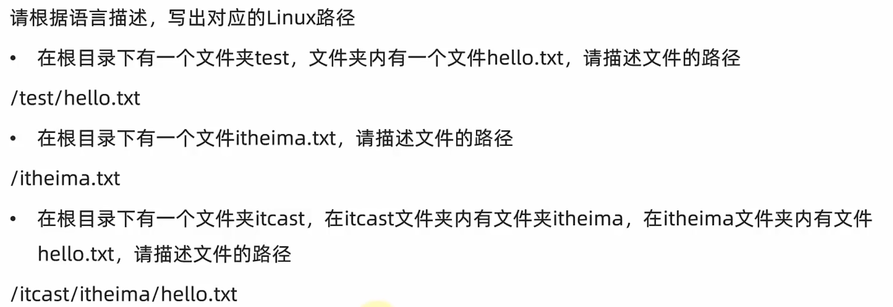
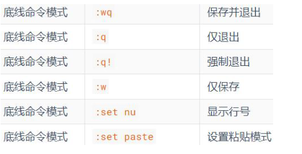

- 
- ## Linux目录结构
	- Linux目录结构？#card
	  card-last-interval:: 4
	  card-repeats:: 2
	  card-ease-factor:: 2.7
	  card-next-schedule:: 2024-01-02T08:23:22.163Z
	  card-last-reviewed:: 2023-12-29T08:23:22.163Z
	  card-last-score:: 5
		- /是根目录的意思
	- {:height 208, :width 462}
- ## Linux 命令基础
	- Linux命令行的格式？ #card
	  card-last-interval:: 10.8
	  card-repeats:: 3
	  card-ease-factor:: 2.7
	  card-next-schedule:: 2024-01-09T03:23:56.475Z
	  card-last-reviewed:: 2023-12-29T08:23:56.476Z
	  card-last-score:: 5
		- commond [-optinon] [paramter]
	- Home目录是？ #card
	  card-last-interval:: 4
	  card-repeats:: 2
	  card-ease-factor:: 2.7
	  card-next-schedule:: 2024-01-02T08:22:20.644Z
	  card-last-reviewed:: 2023-12-29T08:22:20.645Z
	  card-last-score:: 5
		- 每一个用户在Linux系统的专属目录，默认在：/home/用户名
- ## Linux ls命令
	- ls 关于[-a -l -h],-a是什么意思？-l是什么意思？-h是什么意思，必须和哪一个一起使用 ？ ls命令参数是什么？#card
	  card-last-interval:: 4
	  card-repeats:: 2
	  card-ease-factor:: 2.7
	  card-next-schedule:: 2024-01-02T08:23:25.842Z
	  card-last-reviewed:: 2023-12-29T08:23:25.843Z
	  card-last-score:: 5
		- -a: 显示隐藏文件
		- -l：竖列显示，同时显示更多的信息
		- -h：文件大小显示为更易阅读的形式，同时必须和-l一起使用。
		- 参数是文件的地址。
- ## Linux cd pwd命令
	- cd不加参数是什么意思？ pwd什么作用？#card
	  card-last-interval:: 4
	  card-repeats:: 2
	  card-ease-factor:: 2.7
	  card-next-schedule:: 2024-01-02T08:22:18.293Z
	  card-last-reviewed:: 2023-12-29T08:22:18.293Z
	  card-last-score:: 5
		- cd不加参数意思是回到当前用户的home目录下
		- pwd直接打印当前工作目录下的地址
	- 特殊的路径符 .  .. ~ 是什么意思 #card
	  card-last-interval:: 4
	  card-repeats:: 2
	  card-ease-factor:: 2.7
	  card-next-schedule:: 2024-01-02T08:23:27.079Z
	  card-last-reviewed:: 2023-12-29T08:23:27.080Z
	  card-last-score:: 5
		- ~就是home的意思 cd ~意思就是回到home目录下
- ## Linux mkdir命令
	- mkdir -p 是什么意思？ #card
	  card-last-interval:: 4
	  card-repeats:: 2
	  card-ease-factor:: 2.7
	  card-next-schedule:: 2024-01-02T08:22:23.822Z
	  card-last-reviewed:: 2023-12-29T08:22:23.822Z
	  card-last-score:: 5
		- 若果父目录不存在的话，则创建父目录
- ## Linux touch cat more命令
	- touch cat more命令有什么特点？用处是什么？ #card
	  card-last-interval:: 4
	  card-repeats:: 2
	  card-ease-factor:: 2.7
	  card-next-schedule:: 2024-01-02T08:23:37.522Z
	  card-last-reviewed:: 2023-12-29T08:23:37.523Z
	  card-last-score:: 5
		- touch是创建**文件**的命令，直接加路径
		- cat是查看文件内容的命令，直接加路径
		- more是查看文件内容的命令，直接加路径，用空格翻页，使用q退出查看
- ## Linux cp mv rm命令
	- cp mv rm有什么特点？用处是什么？ #card
	  card-last-interval:: 4
	  card-repeats:: 2
	  card-ease-factor:: 2.7
	  card-next-schedule:: 2024-01-02T08:22:14.464Z
	  card-last-reviewed:: 2023-12-29T08:22:14.464Z
	  card-last-score:: 5
		- cp复制，mv移动，rm删除
		- 通过-r选项，操作文件夹
		- 对于mv而言，如果nv test1.txt test2.txt相当于同文件目录下的移动，等于改名字
		- rm可以使用-f，表示强制删除，但是只有在root下会有这个用处
- ## Linux which find 命令
	- which是用于查找什么类型的文件的？find的有哪两种语法？#card
	  card-last-interval:: 4
	  card-repeats:: 2
	  card-ease-factor:: 2.46
	  card-next-schedule:: 2024-01-02T08:21:37.676Z
	  card-last-reviewed:: 2023-12-29T08:21:37.677Z
	  card-last-score:: 5
		- which是用于查找程序地址的指令，which后面直接加要查找的命令即可
		- find有两种
			- find 起始路径 -name 名字
				- 支持通配符
				- find \\home -name \*st\*
			- find 起始路径 -size +|-[KMG]
				- find   \\home -size +100M
	- ## Linux grep wc 通配符命令
		- grep命令的作用，输入?wc命令的输入？ 通配符的作用？ #card
		  card-last-interval:: 4
		  card-repeats:: 2
		  card-ease-factor:: 2.46
		  card-next-schedule:: 2024-01-02T08:21:22.189Z
		  card-last-reviewed:: 2023-12-29T08:21:22.190Z
		  card-last-score:: 5
			- grep是用于过滤内容的。
				- 如果是grep -n "name" xxx.txt 那么就是过滤xxx.txt中的内容，并且显示行号
				- 如果是 cat xxx.txt | grep "name" 也是同样的效果
				- ls | grep "st3" 表示筛选当前目录下包含st3的字符，**注意，此时的输入不再是txt，而是ls的输出**
			- wc是用于数量统计的
				- wc [-c -m -l -w] 文件路径
				- -l 查看行数
				- -w 查看单词数量
	- ## Linux echo 重定向 tail命令
		- echo注意事项，反引号？ 重定向的内容？ tail命令的选项？ #card
		  card-last-interval:: 8.81
		  card-repeats:: 1
		  card-ease-factor:: 2.6
		  card-next-schedule:: 2023-12-21T18:28:22.476Z
		  card-last-reviewed:: 2023-12-12T23:28:22.477Z
		  card-last-score:: 5
			- echo中表示在命令行中输出指定内容
				- 被反引号包围的内容，会被当作命令执行 echo `pwd`
			- 重定向的 > 和>> 注意：重定向符是把**左侧命令的结果**，覆盖或者追加到右侧文件中，一定是左侧命令的结果
				- 例如 `echo "Nihao" > test.txt`
				- \>是覆盖，>>是追加
			- tail是从尾部查看文件内容的操作 有[-f -num]选项 -f表示持续跟踪文件尾部的 -num表示查看末尾多少行，默认是上10
				- tail -f xxx.txt
				- tail -3 xxx.txt
	- ## Linux vim
		- vim的三种模式？分别怎么进入？ #card
		  card-last-interval:: 4
		  card-repeats:: 2
		  card-ease-factor:: 2.46
		  card-next-schedule:: 2024-01-02T08:23:52.735Z
		  card-last-reviewed:: 2023-12-29T08:23:52.735Z
		  card-last-score:: 3
			- 命令模式，使用vim 文件路径直接打开
				- 不存在文件就创建，存在就直接打开
				- 输入模式键入 `ECS`进入命令模式
			- 输入模式
				- 命令模式输入`i o a I O A`进入编辑模式
			- 底线命令模式
				- 命令模式输入`:,`
				- 之后输入 {:height 175, :width 250}用于保存退出显示行号等操作
	- ## Linux --help man命令
		- --help怎么使用 man怎么使用？ #card
		  card-last-interval:: 10.8
		  card-repeats:: 3
		  card-ease-factor:: 2.7
		  card-next-schedule:: 2024-01-09T03:24:12.252Z
		  card-last-reviewed:: 2023-12-29T08:24:12.252Z
		  card-last-score:: 5
			- ls --help直接显示简单的帮助
			- man ls显示完整的英文文档 可以用个 man ls > le_help.txt加载到txt中查看
	-
- {{cards [[Linux第一章]]}}