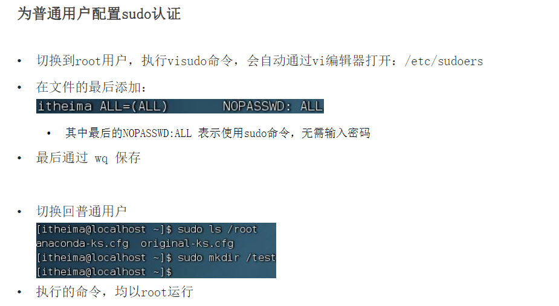
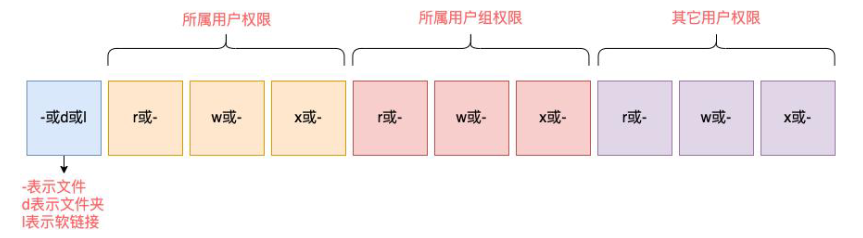

- 
- ## 认识root用户
	- 如何切换至root？ 如何让其他用户拥有执行root的权利和命令？ #card
	  card-last-interval:: 4
	  card-repeats:: 2
	  card-ease-factor:: 2.7
	  card-next-schedule:: 2024-01-02T08:27:02.990Z
	  card-last-reviewed:: 2023-12-29T08:27:02.991Z
	  card-last-score:: 5
		- su -root切换至root用户
			- 普通用户能在/home/用户 下创建文件，但是其他地方不行
			- 切换用户后，可以用`exit`命令回到上一个用户，或者快捷键`ctrl d`
		- 普通用户可以使用sudo 命令来在这一行获取root权限
			- 也可以为普通用户配置sudo认证，就不需要输入密码
			  {:height 329, :width 508}
	- ## Linux 添加组信息
		- ((6578131c-93d9-4567-893f-1b610ac04cc3))
	- ## Linux 权限信息读取
		- ls -l列取的信息第一栏代表什么？第二栏？第三栏？rwx代表什么分别 #card
		  card-last-interval:: 4
		  card-repeats:: 2
		  card-ease-factor:: 2.7
		  card-next-schedule:: 2024-01-02T08:26:59.142Z
		  card-last-reviewed:: 2023-12-29T08:26:59.142Z
		  card-last-score:: 5
			- 
			- r代表可读
			- w代表可写
			- x代表可执行
	- ## Linux chmod更改用户权限 数字序号更改
		- chmod的语法？ 数字权限代表什么？ #card
		  card-last-interval:: 4
		  card-repeats:: 2
		  card-ease-factor:: 2.7
		  card-next-schedule:: 2024-01-02T08:26:15.480Z
		  card-last-reviewed:: 2023-12-29T08:26:15.481Z
		  card-last-score:: 5
			- chmod [-R] 权限 文件或文件夹
				- chmod u=rwx g=wx o=x hello.txt
				- chmod -R 731 /test
				- 数字权限是按照rwx的二进制转十进制来表示的
	- ## Linux修改文件、文件夹的所属用户和用户组
		- ((65781921-0831-44be-abab-46f4999db990))
-
- {{cards [[Linux第二章]]}}