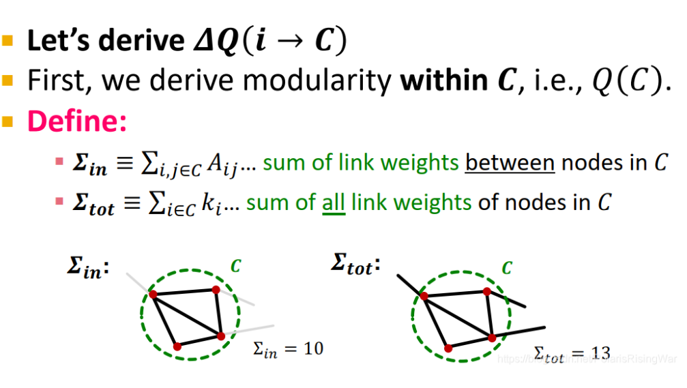
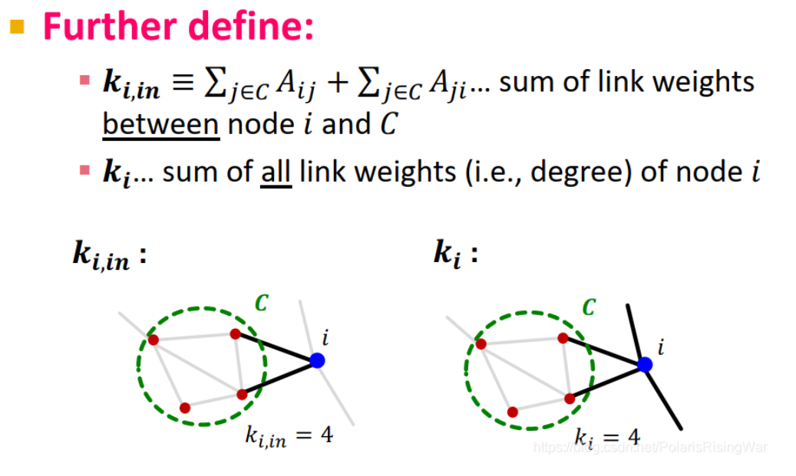

alias:: Louvain

- 定义：用于[[社区]]发现的贪心算法，广泛应用于研究大型网络，快，迅速收敛，输出的[[模块度]]高
- 算法流程（这是一个迭代算法）：
	- Step1：首先初始化所有节点为一个社区（此时社区数目等于节点数目）,使用贪心算法计算节点$i$加入一个社区前后的模块度变化，让$i$加入模块度变化最大的社区，直到模块度没有提升
	- Step2：将第一步得到的社区聚合为新的节点(super-nodes)，再返回到第一个阶段
- 算法示意：
	- {:height 299, :width 459}
	- 如何计算社区的模块度？从原始公式我们可以得到化简后的公式：
	  $$Q=\frac{1}{2m}\sum_{ij}\left[A_{ij}-\frac{k_{i}k_{j}}{2m}\right]\delta(c_{i},c_{j})$$
	  $$Q(C)\equiv\frac{1}{2m}\sum_{i,j\in C}[A_{ij}-\frac{k_{i}k_{j}}{2m}]=\frac{\sum_{i,j\in C}A_{ij}}{2m}-\left(\frac{\sum_{i\in C}k_{i}\sum_{j\in C}k_{j}}{(2m)^2}\right)=\frac{\sum_{\text{in}}k}{2m}-\left(\frac{\sum_{\text{tot}}}{(2m)^{}}\right)^2$$
	  其中，$\sum_{\text{in}}$代表的是社区内总度数(注意，这里的总度数是算的$\sum_{j\in C}A_{ij}+\sum_{j\in C}A_{ji}$，**也就是是边数的二倍**)，$\sum_{total}$代表的是**社区内节点的总度数**，可参考示意图
	  {:height 295, :width 465}
	-
	- 接下来我们要定义节点$\Delta Q(i\rightarrow C)$[[模块度]]的计算
	  {:height 311, :width 466}
	  我们需要计算前后的变化，则需要计算$Q_{before}$和$Q_{after}$，其中$Q_{before}$包括计算$Q$的和$i$的模块度，$Q_{after}$则计算$i$加入$Q$后的模块度
	  $$Q_{\text{before}}=Q(C)+Q(i)=\left[\frac{\sum_{in}}{2m}-\left(\frac{\sum_{tot}}{2m}\right)^2\right]+\left[0-\left(\frac{k_{i}}{2m}\right)^2\right]$$
	  $$Q_{\text{after}}=Q(C+i)=\frac{\sum_{\text{in}}+k_{i,\text{in}}}{2m}-\left(\frac{\sum_{\text{tot}}+k_{i}}{2m}\right)^2$$
	  $$\Delta Q(i\rightarrow C)=Q_{\text{after}}-Q_{\text{before}}=\left[\frac{\sum_{\text{in}}+k_{i,\text{in}}}{2m}-\left(\frac{\sum_{\text{tot}}+k_{i}}{2m}\right)^2\right]-\left[\frac{\sum_{\text{in}}}{2m}-\left(\frac{\sum_{\text{tot}}}{2m}\right)^2-\left(\frac{k_{i}}{2m}\right)^2\right]$$
	  然后我们再计算$Q\left(D\to i\right)$，比较模块度的变化
	  接下来将通过上一步得到的社区收缩到super-nodes，创建新网络，如果原社区之间就有节点相连，就在对应super-nodes之间建边，边权是原对应社区之间的所有边权加总。super-node有自环，自环的权值就是收缩前社区的$K_{in}$然后在该super-node网络上重新运行如上过程。
	  {:height 382, :width 528}