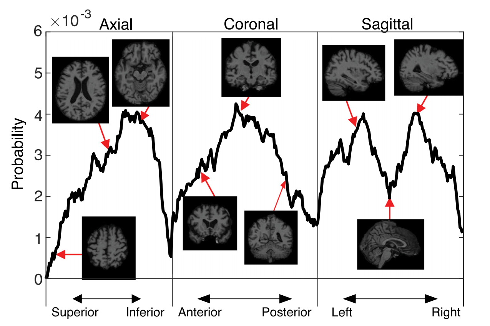
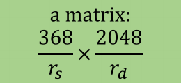

- [[Monte背景]]
- [[Monte方法]]
- [[Monte问题]]
-
- [[论文总结]]
	- Monte Carlo Ensemble Neural Network for the diagnosis of Alzheimer’s disease
		- 这篇论文就是首先用resnet训练了一个网络，这个网络可以将一个二维脑子切片提取为一个2048长度的一维向量，由于每一个病人有368个切片，所以一个病人的输出是368*2048
		- 然后用MCENN这个网络利用368*2048的三位矩阵来判断有咩有得病
			- MCENN也是需要来进行训练的
			- 然后这里面涉及两个采样，一个是对368采样
				- 首先分布函数长这样：
					- 
					- 这个函数分布是通过resnet得出的，采样分布计算为用切片区分CN和AD时，ResNet50得到的AD概率。**注意，resnet是用二维图片，所以可以用368张切片一张一张的进行判断，最后得到这个概率图**
				- 然后根据这个分布函数进行采样，用MCMC采样可以比较好的采样，这里的rs是切片的采样半径，是一个超参数
					- 为什么要采样呢，就是说有的切片的数据可能用不上，可以减少计算量
					- 之后用于临床也可以只用几张图就给你判断了
			- 然后是对2048特征采样
				- 这里就是均匀采样了，因为都是提取出来的高位特征了
				- 然后采样半径rd也是一个超参数
			- MCENN这个网络的输入就变成了一个这样的 {:height 58, :width 104}数据格式
			- 然后对于这个数据格式，文章在这之后采用了两种网络，一个就是一层全连接层，还有一个是一个比较深的网络。结果就是一层就够了，因为本来这些特征就是高维的，还有什么线性非线性的功能，记不得了。
- **我们的实验表明，当使用高分辨率和低分辨率的脑图像时，MCENN模型的AD分类精度具有可比性，这表明MCENN对图像分辨率不敏感。因此，MCENN不需要高分辨率的3D大脑结构图像和全面的图像处理，这支持了其在临床环境中的潜在应用**
	- 还有就是他们这个因为是采样出来的高维特征，可能对图像的分辨率不敏感，用处比较大。