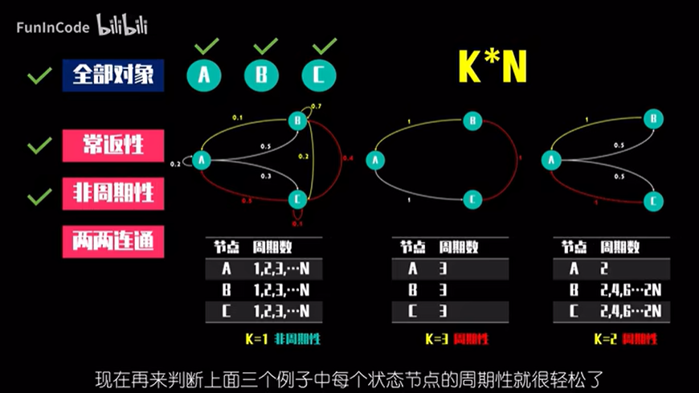
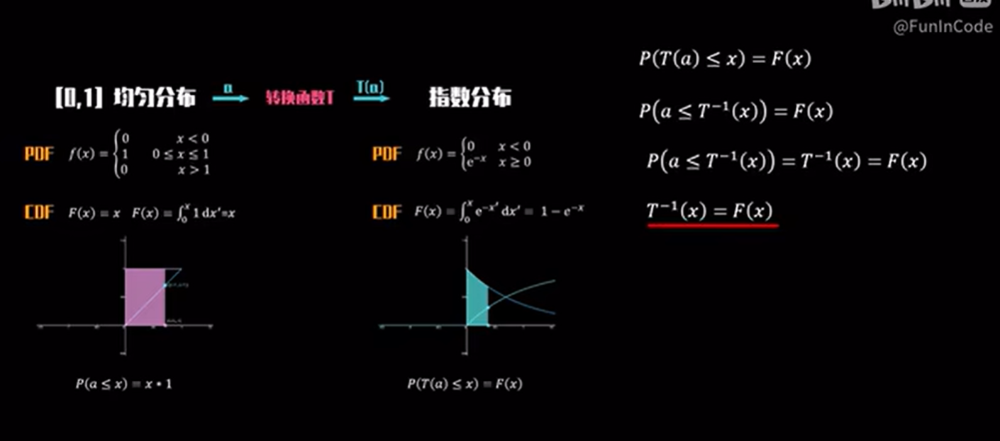

- [[ROI]]
	- [一文读懂3个概念 : RoI, RoI pooling, RoI Align](https://cloud.tencent.com/developer/article/1829792?areaSource=102001.4&traceId=Hf7RHcGoRsodYwOidgeX9)
- [[马尔科夫链]]
	- 马尔科夫链核心三要素
		- 状态空间
		- 无记忆性
		- 转移矩阵
	- 具有唯一稳态的马尔科夫链的三大要求
		- 常返性
		- 非周期性
			- {:height 360, :width 387}
		- 两两连通性
	- 转换函数--已知概率密度分布函数的情形下
		- {:height 333, :width 423}
- [[MCMC抽样]]
	- [马尔可夫链蒙特卡洛方法是什么？]( https://www.bilibili.com/video/BV1iP4y1J7tr/?spm_id_from=333.999.0.0&vd_source=19d43a740c787dccf39bbc5751d77b0c)