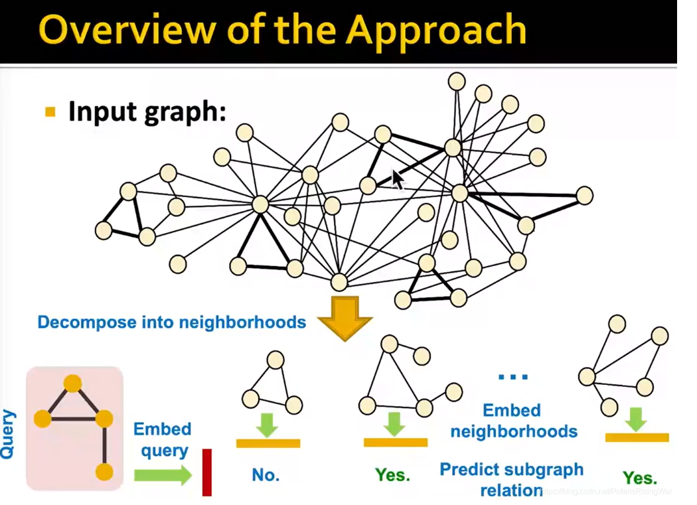

- 问题定义：给出大的target graph，query graph，判断query graph是否是target graph中的子图？
- 整体思路：将target graph拆成很多neighborhoods，计算neighborhoods和query的**嵌入**，将每个neighborhood与query的嵌入做匹配，判断其是否子图同构
  
- 细节：
	- ①计算的是anchor的嵌入，所谓anchor，就是锚点，可以理解为定义子图的K阶邻居的根节点，比如我们要从初始$G_{T}$和$G_{q}$中拆解子图，我们选取一个锚点，然后对这个锚点选取K阶邻居。最后，我们比较的是这个**锚点的嵌入**来判断是否[[同构]]
		- 可以后续识别出对应的特殊节点
	- ②嵌入的是一个[[order embedding spaces]]
		-