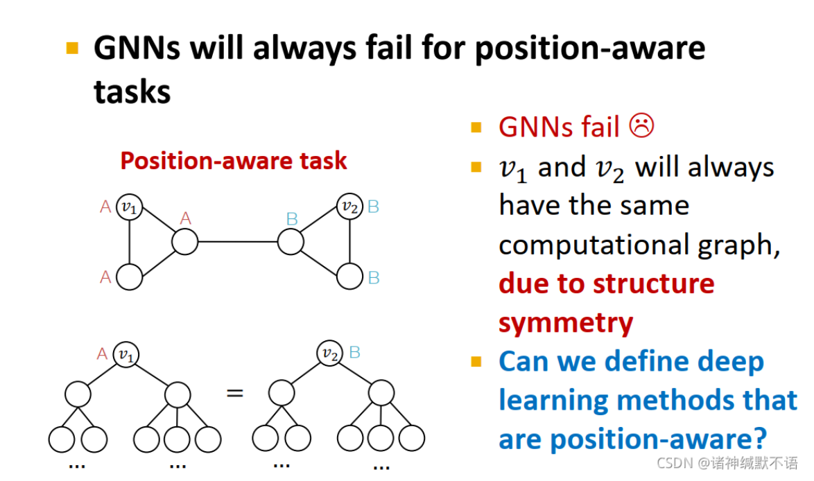
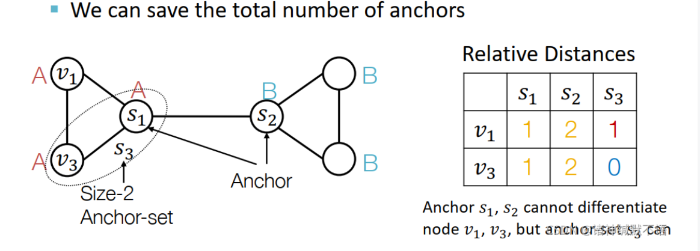

alias:: Position aware GCN

- 定义：用于解决由于在图上位置对称导致的图节点嵌入相同的问题，如下所示：
  
  我们不能区分节点A和节点B的嵌入
- 解决方法--添加anchor-set
	- 所谓anchor-set就是在图上随机找一系列的点，计算其余点到anchor-set点的举例，这样就可以区分对称点，构成新的节点嵌入，增强到原节点嵌入中去。**总的来说，anchor-set中的节点越多，区分效果越好**，如下图所示，在添加$s_3$之后，我们就可以区分$v_1$和$v_3$了
	  
- 要考虑的问题
	- **简单方法**直接把position encoding当作增强的节点特征来用。这样做的实践效果很好。这样做的问题在于，因为position encoding的每一维对应一个随机anchor，所以position encoding本身可以被随机打乱而不影响其实际意义，但在普通神经网络中如果打乱输入维度，输出肯定会发生变化。
	- **严谨方法**设计一个能保持position encoding的permutation invariant性质的特殊神经网络。由于打乱输入特征维度只会打乱输出维度，因此具体维的数据不用改变。
	- 详细请查看[1](https://blog.csdn.net/PolarisRisingWar/article/details/120410245#:~:text=%E5%A6%82%E4%BD%95%E4%BD%BF%E7%94%A8position%20information%EF%BC%88%E5%8D%B3%E4%B8%8A%E5%9B%BE%E4%B8%AD%E8%BF%99%E4%B8%AAposition%20encoding%EF%BC%89)