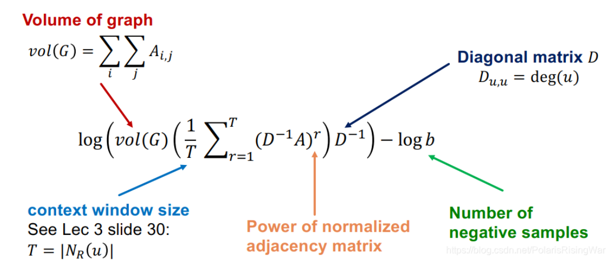

- [PageRank笔记](https://blog.csdn.net/PolarisRisingWar/article/details/117455491)
	- 本章大纲
		- PageRank是一种衡量网络中节点重要性的指标，**主要思想是如果一个节点被很多重要节点指向，那么该节点也很重要**。
			- PageRank 主要方程 $$R = \beta MR+(1-\beta)[\frac{1}{N}]_{N*N}R$$，其中M是随机邻接矩阵，R代表的是重要性，通过[[幂迭代]]求解这个矩阵可以得到R的值,其中后一项是[[teleport机制]]，用于解决蜘蛛陷阱和死胡同问题的。同时，区分PageRank，[[Personalized PageRank]]和[[Random Walk with Restarts]]主要区别在于teleport sets。
			- 蜘蛛陷阱不存在数学上的问题，但是最后求解的R会和期待的求解重要性有较大的出入
			  死胡同在数学上就行不通，随机邻接矩阵列和不为0，初始假设直接不成立
		- 节点嵌入问题可以视作[[矩阵分解]]问题。Deepwalk可以看作对于一个矩阵的矩阵分解。
		  {:height 452, :width 1054}
-