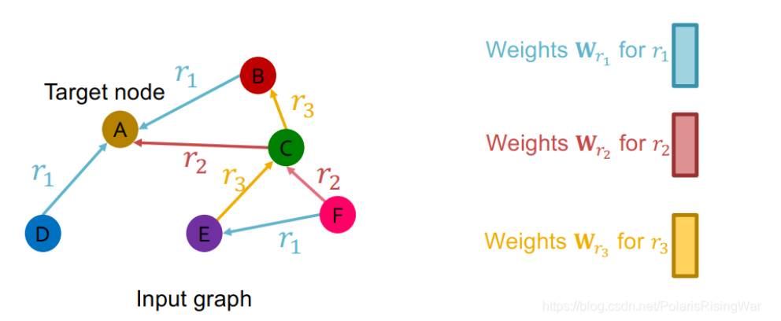
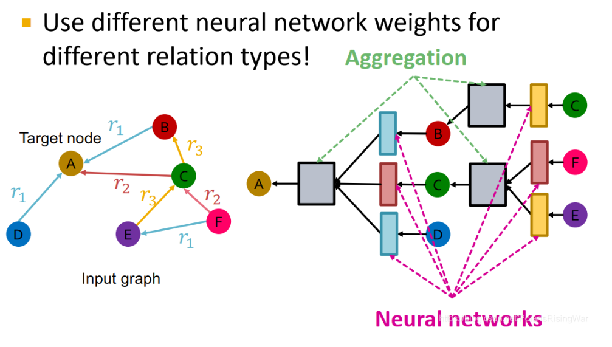
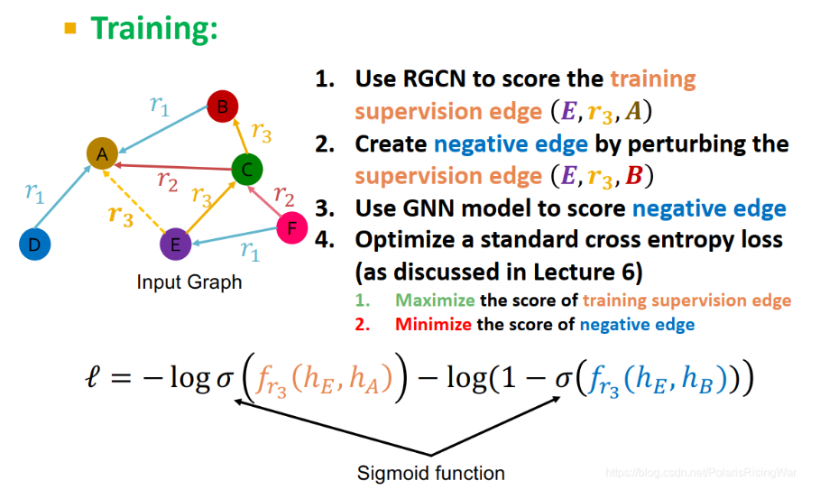
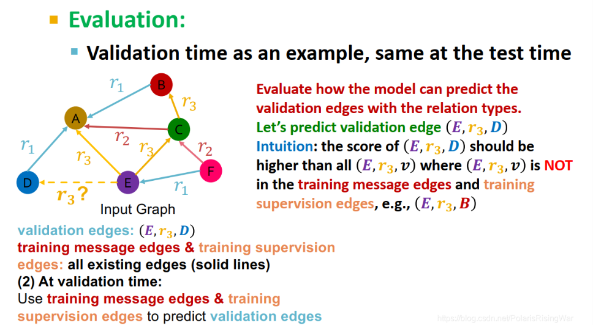
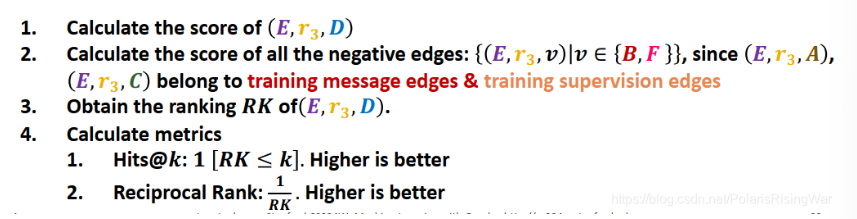

- 定义：将 [[GNN]]拓展到 [[heterogeneous graph]]的方法
	- 在信息转换时，对不**同的边**类型使用**不同的权重**
- 公式:
	- $$h_v^{(l+1)}=\sigma\left(\sum\limits_{r\in R}\sum\limits_{u\in N_v^r}\dfrac{1}{c_{v,r}}\mathbf{W}_r^{(l)}\mathbf{h}_u^{(l)}+\mathbf{W}_r^{(0)}\mathbf{h}_v^{(l)}\right)$$其中$$c_{v,r}$$是对该类型的边的归一化
	- 从信息传递和聚合函数的角度 [1](65992cc8-98ab-499d-994e-bc9c02a7aa79)来理解
	  信息传递的类型包括邻居节点信息传递，自身信息传递，公式分别是：
	  $$
	  \mathbf{m}_{u,r}^{(l)}=\dfrac{1}{c_{v,r}}\mathbf{W}_r^{(l)}\mathbf{h}_u^{(l)}
	  $$
	  $$
	  \mathbf{m}_v^{(l)}=\mathbf{W}_r^{(0)}\mathbf{h}_v^{(l)}
	  $$
	  最后使用聚合函数
	  $$
	  h_v^{(l+1)}=\sigma\left(\text{Sum}(\{\mathbf{m}_{u,r}^{(l)},u\in\{N(v)\}\cup\{v\}\})\right)
	  $$
	-
- 举例
	- 
	- {:height 407, :width 704}
- 存在的问题以及解决方案
	- 问题：每次多一个类型边，就多需要$$W^{1}、W^{2} \dots W^{n},W^{l} \in R^{d^l *d^{(l+1)} }$$个权重层，容易出现过拟合的解决方法
	- 解决方案一：[[block diagonal matrices]]（暂时没看懂）
	- 解决方案二：[[basis learning]]
- 训练方法：
	- 首先需要切割训练集、测试集，通过边进行划分
		- training message edge、training supervision edge
		- validation edge
	- 训练阶段：
		- 用training message edge进行训练
		- 对于training supervision edge进行打乱，得到**negative edge**:\[\text{corrupt}(E, r_3, A) \rightarrow (E, r_3, B)\]其中，\(\text{corrupt}(E, r_3, A)\) 表示对节点 \(E\) 在关系 \(r_3\) 下的尾节点进行修改，举例得到 \((E, r_3, B)\)。
		  
		- 然后用RGCN对training supervision edge和negative edge进行打分得到损失函数
		  $$ \ell = -\log \sigma(f_{r3}(h_E, h_A)) - \log(1 - \sigma(f_{r3}(h_E, h_B))) $$
	- 测试阶段：
		- 我们现在有validation edges，通过validation edges得到negative edges
		- 使用RGCN对所有的validation edges和negative edges的得分
			- 对validation edges和negative edges得分进行排序，validation edges得分为RK
		- 计算指标
			- RK\< k的次数，越高越好
			- Reciprocal Rank $$\frac{1}{RK}$$，越高越好
			  
			  