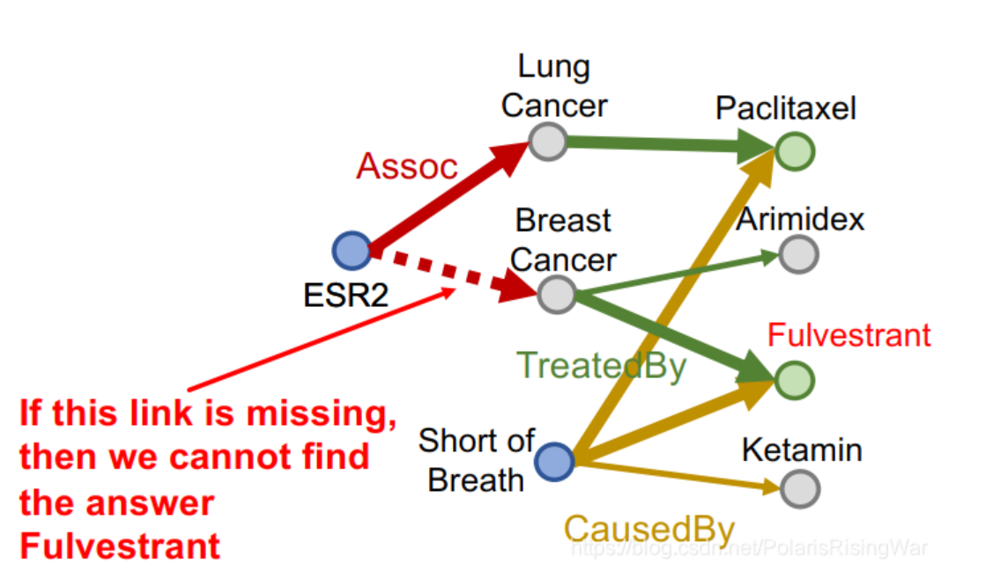
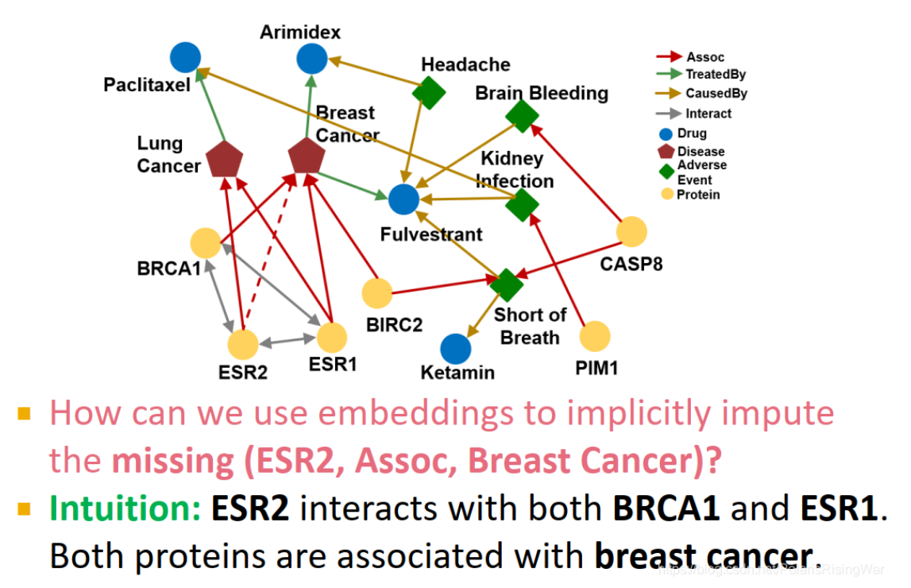

- [Reasoning over Knowledge Graphs笔记](https://blog.csdn.net/PolarisRisingWar/article/details/118614563)
- 任务：在一个不完整（有缺失信息）的大型 [[Knowledge Graphs]] 上做多跳推理（如回答复杂查询问题）。
- 知识图谱上的推理关系分类
	- one-hop query，$$A\to B$$比如[[TransE]]这种
	- path queries，比如$$A\to B\to C$$
	- conjunctive query:比如 $$ (A \rightarrow B) \land (C \rightarrow B) $$
- 如何实现上述不同推理关系问题
  collapsed:: true
	- one-hop query
		- 使用知识图谱的预测任务，比如 [[TransE]] ，可以很好的解决（完整图和不完整图都可以用TransE的方法去解决，本质是一个问题）
	- path queries
		- 如果是关系完整的图，则可以使用遍历的方法得到所有正确的关系
		- 但是如果是不完整的图，采用遍历的方法则会丢失部分正确的解
			- 那么是否可以通过首先先进行TransE预测出所有可能存在的边，然后再遍历？
				- **不行！**KG被补全后就会是一个**稠密****图，因为KG补全后很多关系存在的概率都非0，所以KG上会有很多关系**，在遍历时要过的边太多，其复杂度与路径长度 $L$ 呈指数增长：$O(d_{\text{max}}^L)$，**复杂度过高，无法实现。**
				  id:: 659cb94c-2c28-4336-a327-13ff10cba491
		- **所以如果需要在关系不完整图上解决path queries的问题，需要使用预测的方法**
			- 解决方法：同样使用 [[TransE]]，但是不是首先补全为完整关系图，再去遍历，而是运用Composition relations的方式来进行预测（注意TransR等方法不能实现，因为不具备处理Composition relations的能力）
	- conjunctive query
		- 如果是关系完整的图，则可以使用遍历的方法得到所有正确的关系
		- 但是如果是不完整的图，采用遍历的方法则会丢失部分正确的解
		- 不能够使用[[TransE]]来实现这种查询，因为TransE不具备查询conjunctive query的能力
		- 所以需要使用一种隐式的方法，来学习嵌入并且进行预测，同时需要定义intersection的操作，使用[[query2box]]的方法
		  collapsed:: true
		  {:height 450, :width 679}
		  {:height 450, :width 679}
			- assets:///D%3A/iCloud~com~logseq~logseq/assets/image_1704771268588_0.png