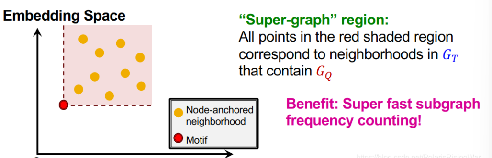

- 方法（思路很简单）：
	- 我直接对$G_{T}$进行抽样，把抽样出来的图的 [[order embedding spaces]]全部计算出来，然后就可以知道某一个特定的motif是多少抽样图的子图
	  
	  如图所示，红色区域就是以motif为子图的图的个数
- 问题在于如何搜索出**大小为K**的最高的motif（注意，我们这里的问题探讨的是我给定一个尺寸K，这个尺寸K里面有很多motif，我要选出其中最大或者前几大的motif）
	- 采用贪心算法
		- 首先选取一个节点作为起点$S=\left\lbrace u\right\rbrace$
		- 然后选取$u$的邻居节点加入到$S$中
			- 这一步就开始使用贪心算法，只选取这样的一个节点，满足：选取该节点，能够使得$S$成为被最多图包含为子图的motif
		- 然后持续生长，不断选取新的节点加入$S$，最后$S$的大小长到K即可
		-
		-
	-