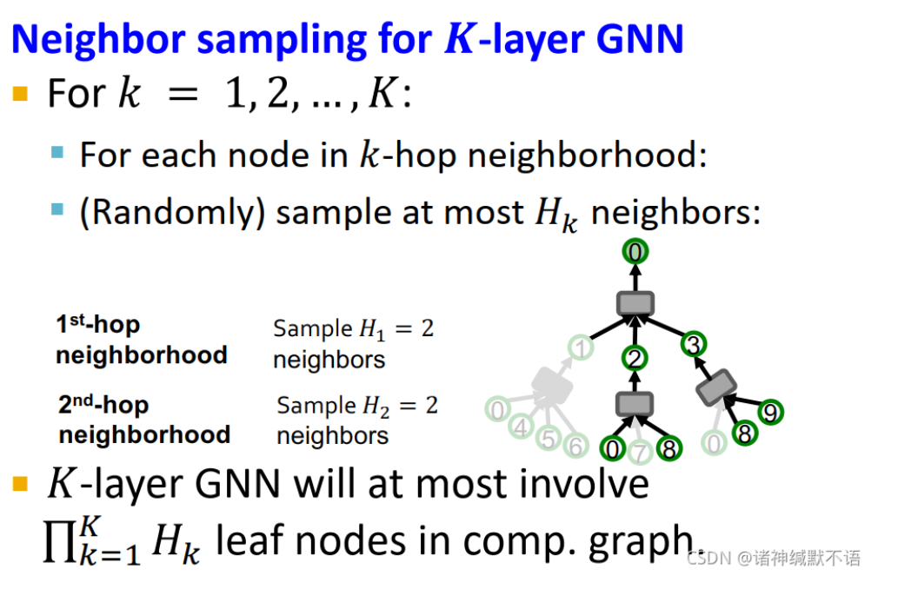
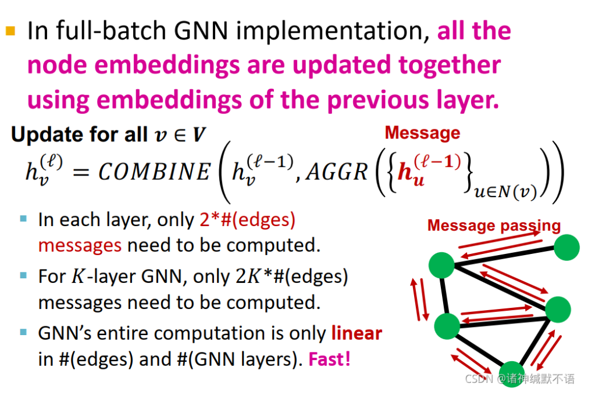
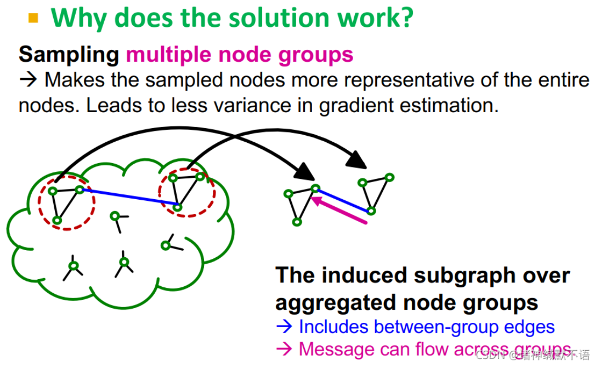
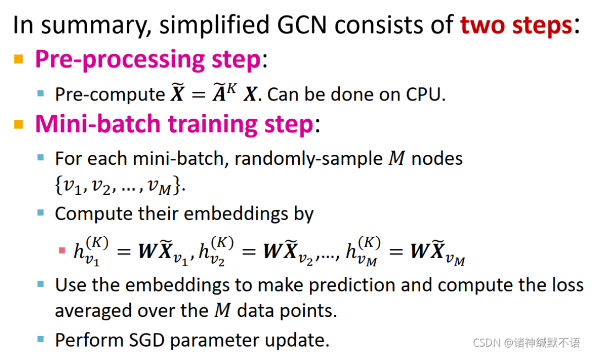
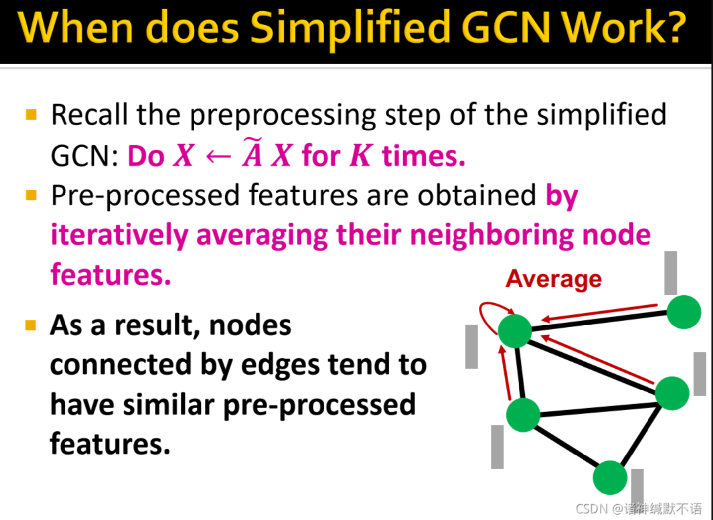
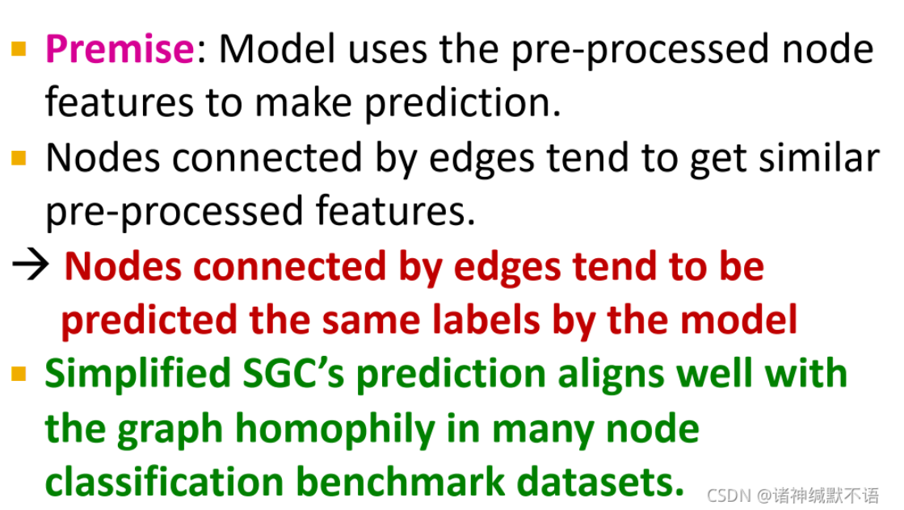

alias:: 大规模图

- [Scaling Up GNNs to Large Graphs笔记](https://blog.csdn.net/PolarisRisingWar/article/details/120972616)
	- 本章大纲
		- 大规模图应用的问题
			- 简而言之，我们无法对于一个极大规模的进行运算（算力有限），所以只能采样，但是我们如果随机采样一系列点，我们是无法进行GCN运算的，因为我们采样点不一定是彼此的邻居，导致我们无法进行训练更新（训练是在采样节点上进行的，节点极度离散，要聚合邻居时，邻居不在采样点内，咋更新）。如图所示：
			  {:height 304, :width 410}
		- 三种不同的思路
			- 抽样 + [[GraphSAGE]]方法
				- 在一个min-batch中，采样一系列的点M，然后计算M的计算图（采样K阶邻居）来正常嵌入，同时为了避免邻居节点可能存在[[hub-node]]，以及K阶需要聚合大量信息，所以每一次采样的时候，都指定一定的数量进行采样而不是全部，如图所示：
				  {:height 560, :width 526}
				- 问题：
					- 虽然采样简化了，但是会导致采样的方差很大，导致训练不稳定
					- 虽然采样简化了，但是计算开销会随着K阶采样呈现指数增长
				- 如何抽样节点？
					- 1. 计算各节点自所求节点开始的random walk with restarts分值 $R_i$
					- 2. 每一层抽样$H$个$R_i$最高（与原节点相关性最高的节点）的邻居节点$i_{ii}$
			- 抽样 + [[Cluster-GCN]] 方法
				- 我不采样节点，我**直接采样一个子图**出来，然后在子图上进行信息传递的时候的计算开销就不是指数增长的了，而是线性的（$\#edges$），如图所示
				  {:height 326, :width 464}
				- 直接使用 [[Louvain]]等社区算法分割出子图（节点集1，节点集2等），然后每次采样是在单个节点集上，然后对这个节点集上的采样出来的点构建node-induced的[[子图]]，然后进行上述复杂度为$\#edges$的节点更新
				  > {{embed ((659d3343-c015-405e-a6c4-e89296a6492a)) }}
				- 问题：
					- 每次都是在社区内采样，不能构建跨社区的信息传递，移除了组间的链接，这使得其他组对该组的信息会在信息传递的过程中丢失，这会影响GNN的实现效果。
					- 并且图社区检测算法会将相似的节点分到一类中，这样被抽样的node group就会倾向于仅包含整个数据的一个很集中的部分。
					- 最后被抽样的节点不够多样化，都是在社区内采样，导致不同采样方差大，训练收敛慢
				- 解决方法
					- 将图划分为相对来说较小的节点组，在每个mini-batch中，**抽样并聚合多个node groups**，构建**node-induced** 子图，这样就可以在不同社区之间信息传递了
					  {:height 313, :width 451}
			- 简化GCN的方法
				- 核心思想，**不要非线性激活层**了
				- 方法：
					- 传统GCN：
					  $$H^{(k+1)}=Relu\left(\tilde{A}H^{(k)}W_{k}^{T}\right)$$
					- 简化GCN：
					  $$H^{(k+1)}=\tilde{A}H^{(k)}W_{k}^{T}$$
					  $$H^{(k+1)}=\tilde{A}H^{(k)}W_{k}^{T}=\tilde{A}\left(\tilde{A}H^{\left(K-1\right)}W_{k-1}^{T}\right)W_{k}^{T}=\ldots=\tilde{A}^{K+1}XW^{T}$$
					  Where $W_{}^{T}=W_0^{T}W_1^{T}W_2^{T}W_3^{T}\ldots W_{K}^{T}$，线性层乘上线性层还是线性层
					- 所以计算就很简单了，如下：
					  {:height 490, :width 635}
					- 预处理步骤：预计算 $\tilde{X} = \tilde{A}^KX$ （不包含神经网络，可以在CPU上进行）
					- 小批量训练步骤：
					  对于每个小批量，随机抽样$M$个节点 $\{v_1, v_2, \dots, v_M\}$
					  计算它们的嵌入：$h_{v_1}^{(K)} = WX_{v_1}, h_{v_2}^{(K)} = WX_{v_2}, \dots, h_{v_M}^{(K)} = WX_{v_M}$
					  使用这些嵌入进行预测，并计算在$M$个数据点上的平均损失函数。
					  应用随机梯度下降（SGD）进行参数更新。
				- 为什么可行？ 因为和图本身的同质化本质相同
				- 在半监督学习的节点分类基准测试中，简化GCN和GNNs几乎具有相同的表现能力，这是由于图同质性的存在，**即相连的节点对倾向于具有相同的标签**。举个例子，在文献引用网络中进行文献分类任务时，引用的文献通常属于同一类别；在社交网络中进行用户推荐电影的任务时，社交网络中的朋友关系用户往往倾向于喜欢相同的电影。在简化的GCN中，预处理阶段使用 $\tilde{A}\cdot X$ 进行 $K$ 次迭代，**即通过邻居节点特征的平均值计算预处理特征**($\tilde{A}$**本身就是平均化的邻接矩阵，所以这里叫做通过邻居节点的平均值**)。因此，相连的节点倾向于具有相似的预处理特征，这使得模型倾向于将相连的节点预测为相同的标签，从而很好地对齐了许多节点分类基准测试数据集中的图同质性性质。
				  {:height 605, :width 677}
				  {:height 505, :width 700}
			-
-