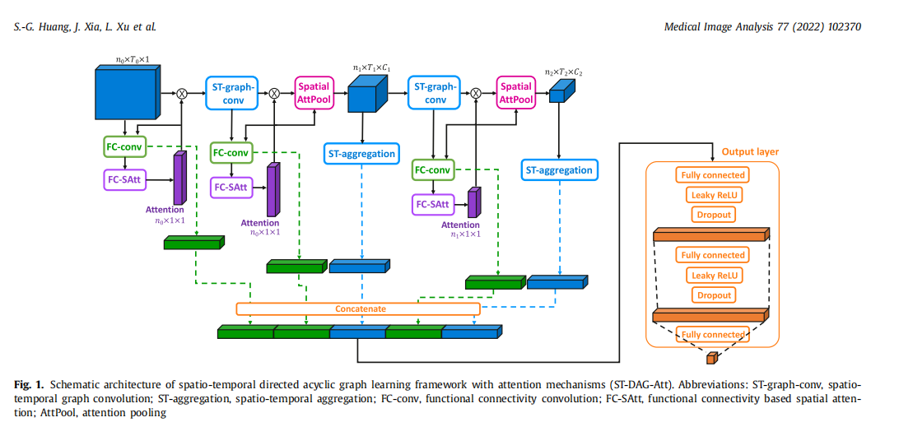
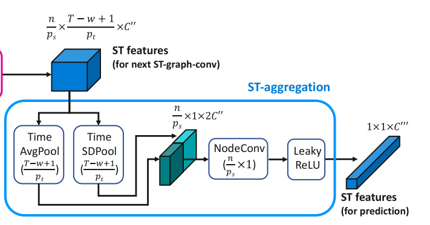

- [[Spatio-tempora背景]]
- [[Spatio-tempora问题]]
- DONE 论文中的红色没看，spatio红色1
  :LOGBOOK:
  CLOCK: [2023-08-20 Sun 19:29:29]--[2023-08-20 Sun 19:29:30] =>  00:00:01
  CLOCK: [2023-08-20 Sun 19:29:30]--[2023-08-20 Sun 19:29:31] =>  00:00:01
  :END:
- DONE 论文中的红色没看，spatio红色2
- DONE 论文中的红色没看，spatio红色3
- [[论文总结]]
	- 把 [[BrainNetCNN]]学习了，还有 [[brain中运用CNN]]的论文看了
	- 学习了加深了卷积的理解，包括维度之类的关系
	- 其次学习了GCN的得来和拉普拉斯矩阵还有切比雪夫多项式和一阶切比雪夫近似有关
		- 习了GCN的得来和拉普拉斯矩阵还有切比雪夫多项式和一阶切比雪夫近
	- 
		- 首先结构主要是时间上的卷积，temporal convolution，这个操作就是在时间维度上进行了卷积，所以时间维度上的长度变了，目的就是提取时间维度的特征嘛 此时的维度为$$n*\frac{T-w+1}{p_t}C^{\prime}$$
		- 然后就是从节点层面的空间卷积，这一步里面提到了[[切夫雪比多项式]]还有拉普拉斯矩阵，其实这个就是GCN的原理部分，这里的空间卷积就是从节点层面运用GCN，你看嘛，节点的个数n都没有改变，此时的维度数为$$n*\frac{T-w+1}{p_t}*C^{\prime \prime}$$
			- 之后就是一个Spool的过程，这里就是类似于降维池化，此时的维度为$$\frac{n}{p_s}*\frac{T-w+1}{p_t}*C^{\prime \prime}$$
		- 然后就是把这时空卷积后的整合到一起，怎么整合的呢，其实 
		  就是在t层面进行降维，这是两个并行的操作，一个AVGpool，一个SDpool，把时间维度池化到一维，然后把这两个矩阵沿着通道方向排在一起（$$\frac{n}{p_s}*1*2C^{\prime \prime}$$），然后再对节点进行池化降维，这样就把时空信息聚合到一起**输出一个ST feature了**
		- 里面有个模块叫FC-conv
			- 这个模块就是根据输入，然后皮尔逊相关系数操作后把这个输入变为邻接矩阵形式的，然后进行边、节点层面的姜维，最后成为一个一维向量，**输出FC--feature**
			- 里面有个注意力模块，这个模块也就是把已经边卷积过后的矩阵，进行再操作得到一个n*1*1的矩阵（沿着通道方向聚合的这里，把每个节点所有的特征加在一起，而这些特点是之前的边聚合而来，所以这个操作其实是把分析每一个单独节点的重要性），再把这个矩阵通过一顿全连接得到每个节点的系数，也就是注意力系数。
			- 然后根据注意力系数，进行一个类似于TopKpooling的操作，删掉一些节点，方便计算和特征提取
	- 其实一个完整的ST-DAG-Att卷积只能得到一个st和fc feature，但是图中根据原始数据也做了一次fc操作，所以最后因为两个ST-DAG-Att操作，最后是1fc，1fc+1st，1fc+1st的聚合特征向量。