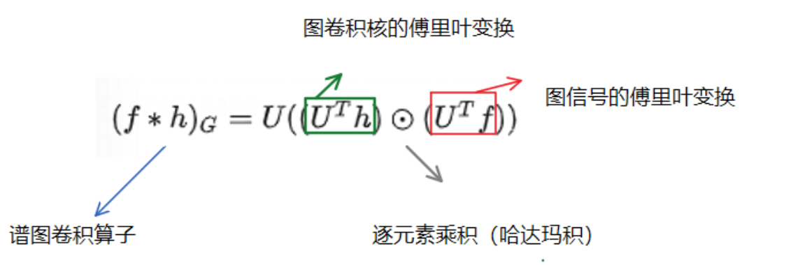

- [[图傅里叶变换]]
  collapsed:: true
	- 拉普拉斯矩阵--**拉普拉斯算子是所有自由度上进行微小变化后所获得的增益**。
		- [理解图的拉普拉斯矩阵 ](https://zhuanlan.zhihu.com/p/362416124)
		- [图卷积神经网络系列](https://zhuanlan.zhihu.com/p/137897522)
			- {:height 328, :width 669}
			  **拉普拉斯矩阵反映了当前节点对周围节点产生扰动时所产生的累积增益。**直观上也可以理解为某一节点的权值变为其相邻节点权值的期望影响，形象一点就是**拉普拉斯矩阵可以刻画局部的平滑度。**
			- 
			- 
			  根据上述的表示我们可以知道：$$U^T h其实就是将h转为频域，U乘上频域就是变为图域$$
- [[切夫雪比多项式]]
  collapsed:: true
	- [GCN 笔记：图上的傅里叶变换](https://blog.csdn.net/qq_40206371/article/details/118230105)
	- [GNN笔记：图卷积](https://blog.csdn.net/qq_40206371/article/details/118424118?csdn_share_tail=%7B%22type%22%3A%22blog%22%2C%22rType%22%3A%22article%22%2C%22rId%22%3A%22118424118%22%2C%22source%22%3A%22qq_40206371%22%7D)
	- [GCN笔记：Graph Convolution Neural Network，ChebNet](https://blog.csdn.net/qq_40206371/article/details/126679141) 这个是介绍如何引进切比雪夫多项式来更好的聚合节点关系的
		- 为什么要使用谱图卷积：**如果在空域分析问题的话，那么由于每个点邻居的数量不一样，所以处理的时候需要逐点进行处理，而由于图结构大部分是非欧几里得结构的链接关系，所以这样node-wise processing的话，在很多场景下会有局限性；****而在频域中的话，不需要node-wise的处理操作**、
		- 切比雪夫多项式：
			- $$T_k(\hat{L})=2\hat{L}T_{k-1}(\hat{L}-T_{k-2}{\hat{L}})$$$$
			  T_0(\hat{L} )= I,T_1(\hat{L})=\hat{L}$$
	- 在GCN ver1.0 中，使用谱图卷积的可学习参数是
	  id:: 64e32991-6f73-4c07-81bd-6500339938b1
	  {:height 249, :width 586} 
	  {:height 195, :width 593}
	  不具有spatial localization，不能很好的体现邻居信息
	  所以考虑用切比雪夫多项式作为谱图卷积的卷积核，其[推导如下](https://blog.csdn.net/qq_40206371/article/details/126679141#:~:text=2.1%20%E5%8E%9F%E7%90%86-,%E4%BD%BF%E7%94%A8%E5%88%87%E6%AF%94%E9%9B%AA%E5%A4%AB%E5%A4%9A%E9%A1%B9%E5%BC%8F%E4%BD%9C%E4%B8%BA%E8%B0%B1%E5%9B%BE%E5%8D%B7%E7%A7%AF%E7%9A%84%E5%8D%B7%E7%A7%AF%E6%A0%B8,-%E2%80%94%E2%80%94k%E9%98%B6%E5%88%87),-**这样一个Filter，进行chebNet的结果就是N*1，如果有q个filter，那么结果就是N*q**
	- GCN_ver2.0（ChebNet的一阶近似）**原来GCN最后的形式就是用了切比雪夫多项式的一阶近似**
		- [推导在这里](https://blog.csdn.net/qq_40206371/article/details/126679141#:~:text=3-,GCN_ver2.0%EF%BC%88ChebNet%E7%9A%84%E4%B8%80%E9%98%B6%E8%BF%91%E4%BC%BC%EF%BC%89,%E4%B8%80%E4%B8%AA%E5%B1%82%E7%BA%BF%E6%80%A7%E6%96%B9%E7%A8%8B)，然后我们堆叠K个GCN，就可以利用节点的K阶邻居（1阶就是挨着的，2阶就是1阶挨着的）
- [[ST GCN]]
- 引用文献
  collapsed:: true
	- #brain中运用CNN
		- [[论文总结]]
		- 这篇文献是用CNN来分析学习脑子，但是学习肯定不只是简单的把脑子图像丢进去，而是首先通过手段结合fMRI得到了56个不同的，功能性连接图，比如说思考问题时候的脑功能连接图等等，然后把这56个图全部组成一个4D矩阵，开始训练。
		-
	- #BrainNetCNN
		- [[DTI]]
			- [DTI技术原理及临床应用 ](https://zhuanlan.zhihu.com/p/407887063)
			  id:: 656ed9f7-dfaf-4e05-ac82-a16774ed1cca
			- 关于DTI，其实就是采用类似Diffusion的方法，来描述人体中水分子扩散的各向异性。
			  id:: 656c1704-f6fd-479e-8eca-2781acc4afb5
				- [什么叫各向同性扫描？](https://mp.weixin.qq.com/s?__biz=MzI1NzU4Njg2OQ==&mid=2247487988&idx=1&sn=bef3bb0ef0ab58742cc8358de6020727&chksm=ea14722edd63fb38bf479cc12c7477ac532dace26feed83c11a5f6948ee93deddeb66a2bc569&scene=21#wechat_redirect)
		- [[论文总结]]
			- 这篇文章是开创性的考虑了脑子之间的拓扑结构，其邻接矩阵是由DTI得来的，数值是和连接数量相关的。有三个层，一个是E2E，一个是E2N，一个是N2G。他这里不一样的地方时E2E中，为什么有r和c两个参数呢？ 
			- ①这里是**对边进行加权**，一条边有两个点i，j，所以计算一条边下一个的值的时候，必须考虑i，j这两个点与其他点之间的节点连接，所以有两个参数r和c。同时由于每个节点可能有Ω条边，所以计算ij边时，一共要2Ω个参数，因为两个点一个点一个Ω嘛。（对边进行加权，而不是对节点加权）
			- ②同时这里的M是当前特征图里一共有多少层，m是具体的层，n是输出后的对应的第几层。无论怎么说，**n的得来一定是前一个输入特图所有特征边经过加权求和而来的。**（这句话很关键！）
				- >**n的得来一定是前一个输入特图所有特征边经过加权求和而来的。**
			- ③画图理解一下，可以知道对于ij这条边，要确定在下一个第n层的ij参数，一共需要2Ω*Ml个参数
			- 然后E2N这个层， 
			  为什么也是r，c两个参数呢，其实把有点重复算的意思，不知道为啥
			- 然后就是经典卷积全连接层输出
			-
-