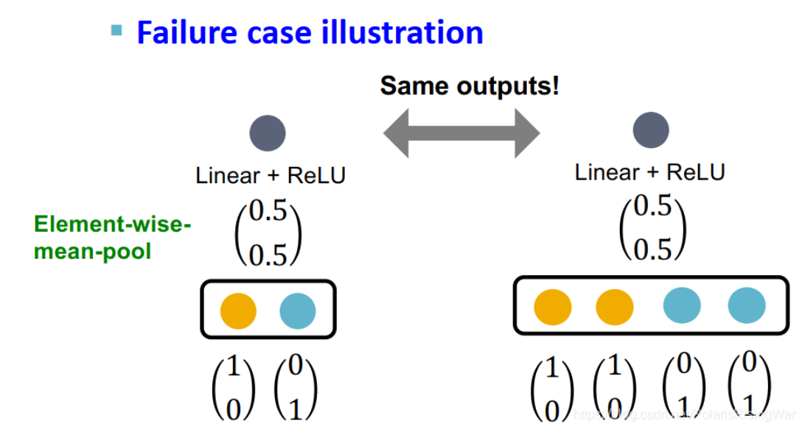
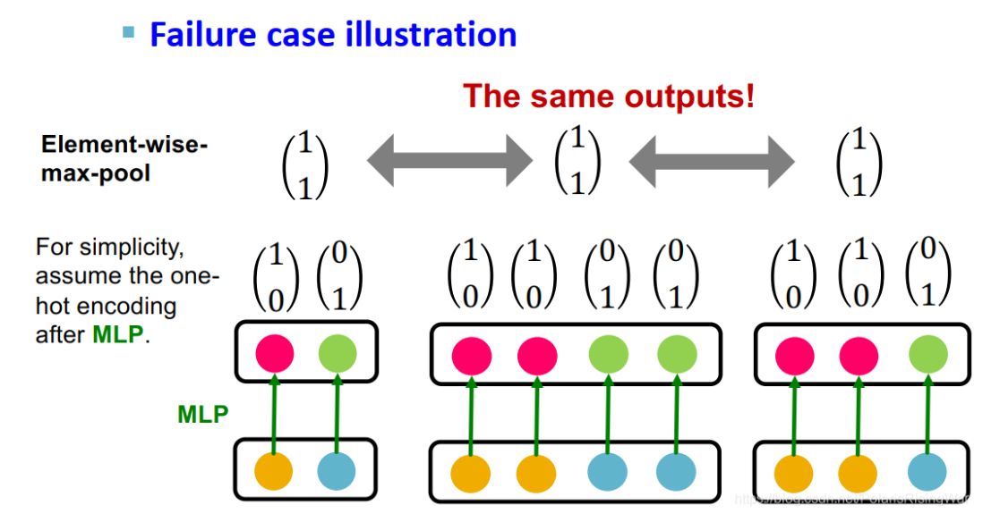
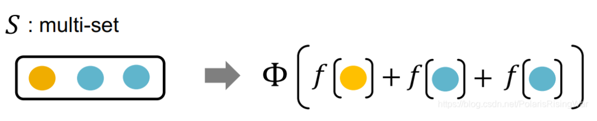
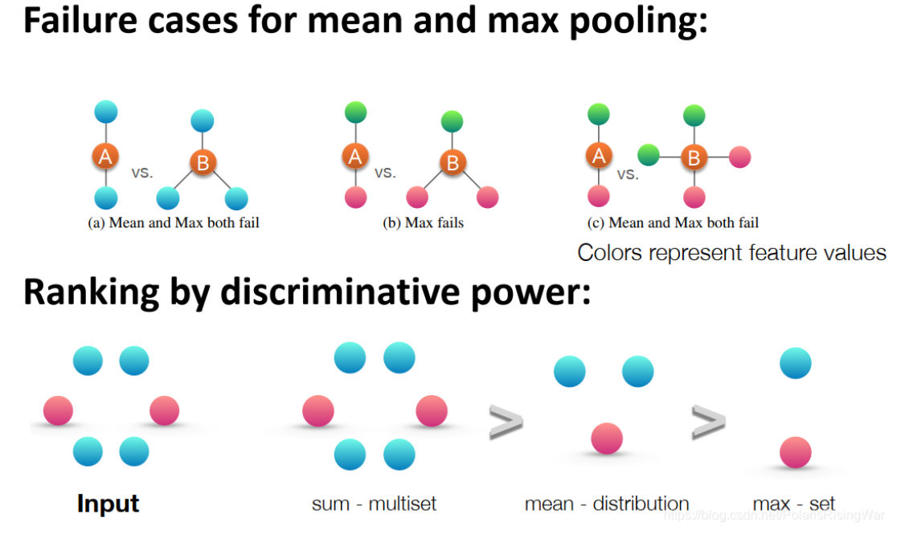

- [ Theory of Graph Neural Networks笔记](https://blog.csdn.net/PolarisRisingWar/article/details/118333098)
	- 本章大纲：识别具有不同结构的图
		- **GNN无法区分具有相同 [[computational graph]] 的节点。**：GNN通过计算图 [[computational graph]] 捕获节点的局部邻居结构，但是由于聚合函数不具有单射能力，导致再捕获局部邻居结构时会存在信息丢失。因此，**GNN无法区分具有相同 [[computational graph]] 的节点。**
		- 强表达能力的GNN的**聚合函数****是单射的**：如果GNN能将具有**不同**（相同的情况已经讨论了，无法区分） [[computational graph]] 的节点区分开来，则我们称该GNN具有强表达能力，即计算图中的信息得到了完全的保留。**相同的 [[multi-set]]应该被映射到相同的output，但是不同的multi-set应该被映射到不同的output上去，目前的聚合函数问题在于，就算是不同的multi-set也被映射到了相同的output上，所以我们需要单摄函数**
			- 常见的聚合函数有Mean-pool和Max-pool，他们**不能够[[单摄]]**，不够具有表达能力。
			  id:: 659a8703-b46d-4dfd-b83f-7a7f6b8b0364
				- Mean Pool 失败案例
				  {:height 216, :width 366}
				- Max Pool 失败案例
				  {:height 216, :width 366}
		- 我们的目标是设计信息传递框架下表示能力最强的GNN [[GIN]] ，这要求我们设计出[[multi-set]]上的单射邻居聚合函数。单摄聚合函数都可以表示为以下形式：
		  $$\Phi\left(\sum\limits_{x\in S}f(x)\right)，f和\Phi是非线性函数，x是特征$$
		  
			- 根据[[universal approximation theorem]]，可以采用MLP和合适的非线性函数建模出任一单射函数，所以上述单摄函数可以表示为：
			  $$\text{MLP}_\Phi\left(\sum\limits_{x\in S}\text{MLP}_{f}(x)\right)$$
			- 其聚合函数是单射的，没有区分失败的案例，是信息传递类GNN中表示能力最强的GNN
		- [[GIN]]和[[Weisfeiler-Lehman]]的关联
			- | |更新目标        | 更新函数                     |
			  |----------------|----------------------------|
			  | WL graph kernel | 节点颜色（独热编码）     | HASH                       |
			  | GIN            | 节点嵌入（低维向量）        | GINConv                    |
			- GIN的优点在于：
				- 节点嵌入是低维的，因此可以捕获到细粒度的节点相似性[14](https://blog.csdn.net/PolarisRisingWar/article/details/118333098#fn14)
				- GINConv的参数可被学习得到并应用于下流任务 [15](https://blog.csdn.net/PolarisRisingWar/article/details/118333098#fn15)
		- 各种池化能力的比较：
			- sum能区分整个 [[multi-set]] ，mean只能区分不同的分布，max只能区分元素类型集合，所以$$sum>mean>max$$
			  {:height 389, :width 635}