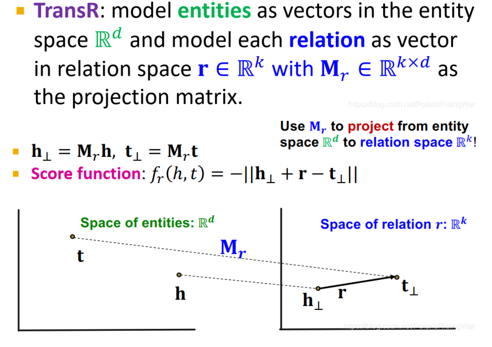

- 定义：实体映射为实体空间 $\mathbb{R}^d$ 上的向量，关系映射为关系空间上的向量 $r \in \mathbb{R}^k$，投影矩阵 $M_r \in \mathbb{R}^{k \times d}$。用 $M_r \in \mathbb{R}^{k \times d}$将实体从实体域投影到空间域上：$h_\bot = M_r h$，$t_\bot = M_r t$。计算方法：$f_r(h, t) = -||h_\bot + r - t_\bot||$
	- 注意，此处是通过 $M_r \in \mathbb{R}^{k \times d}$将在 $\mathbb{R}^d$上的实体映射到$r \in \mathbb{R}^k$上
- 示意图：
	- {:height 512, :width 694}