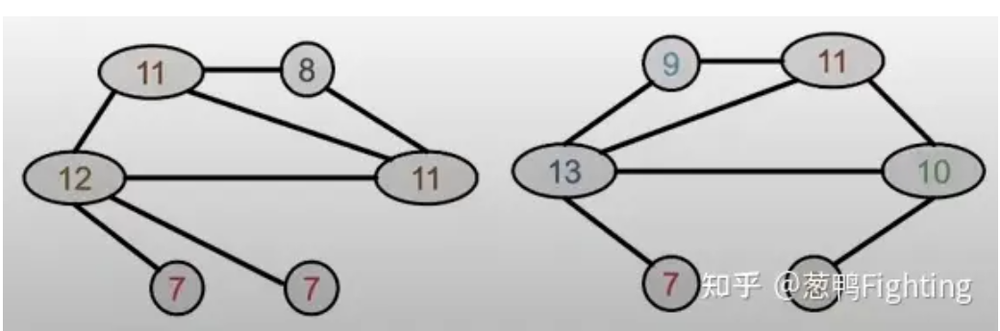

- 定义：
  $$c^{(k+1)}(v)=\text{HASH}\left(c^{(k)}(v),\{c^{(k)}(u)\}_{u\in N(v)}\right)$$
- 举例：
	- Step1 每一个节点指定初始颜色
	  {:height 170, :width 583}
	  Step2 第二步，为每个节点聚合邻居节点的颜色信息，以第一个图左上角的节点为例，它包含三个邻居节点，因此聚合后的信息变成了(1, 111)：
	  {:height 147, :width 554}
	  Step3 根据HASH表映射每个节点聚合后的颜色，仍然以第一个图左上角节点为观察对象，经过HASH映射，它由(1, 111)映射成了对应的颜色：
	  {:height 148, :width 575}
	  之后进行迭代，直至稳定
	  {:height 194, :width 565}