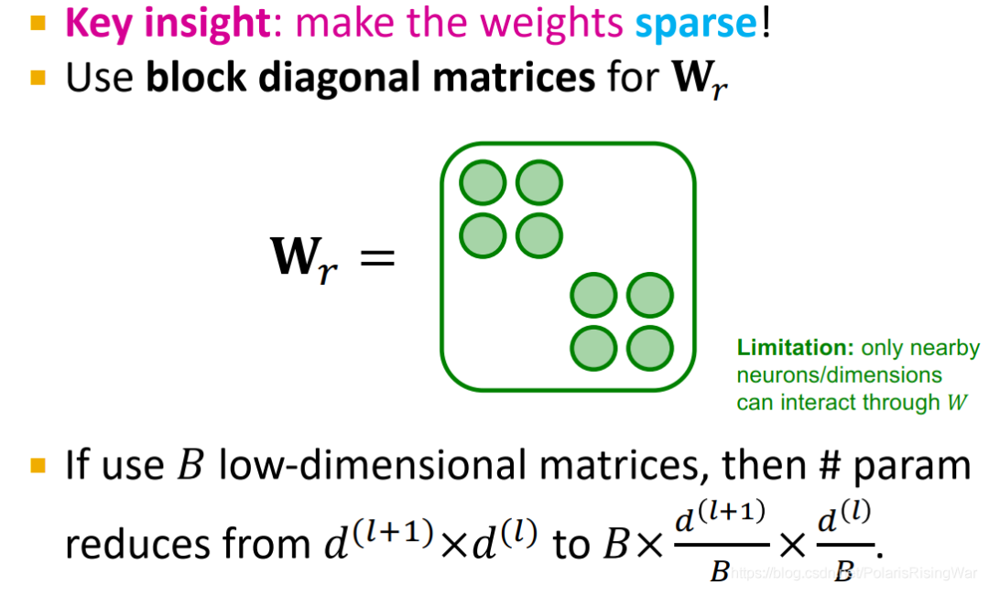

- 定义：使权重矩阵变稀疏，减少非零元素数量。做法就是如图所示，让权重矩阵成为这样对角块的形式。如果用 B 个低维矩阵，参数量就会从 $d^{(l+1)} \times d^{(l)}$ 减少到 $B \times d^{(l+1)} \times \dfrac{d^{(l)}}{B}$。这种做法的限制在于，这样就只有相邻神经元/嵌入维度可以通过权重矩阵交互了。要解决这一限制，需要多加几层神经网络，或者用不同的 block 结构，才能让不在一个 block 内的维度互相交流。
- 示意图：
	- {:height 659, :width 1092}