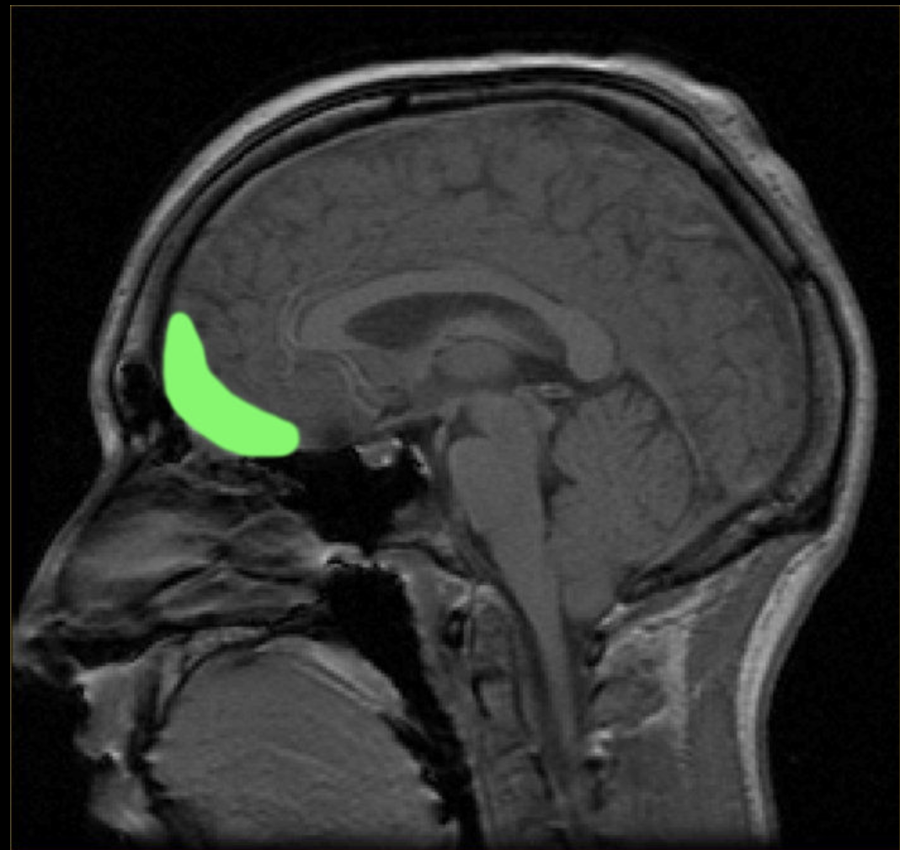
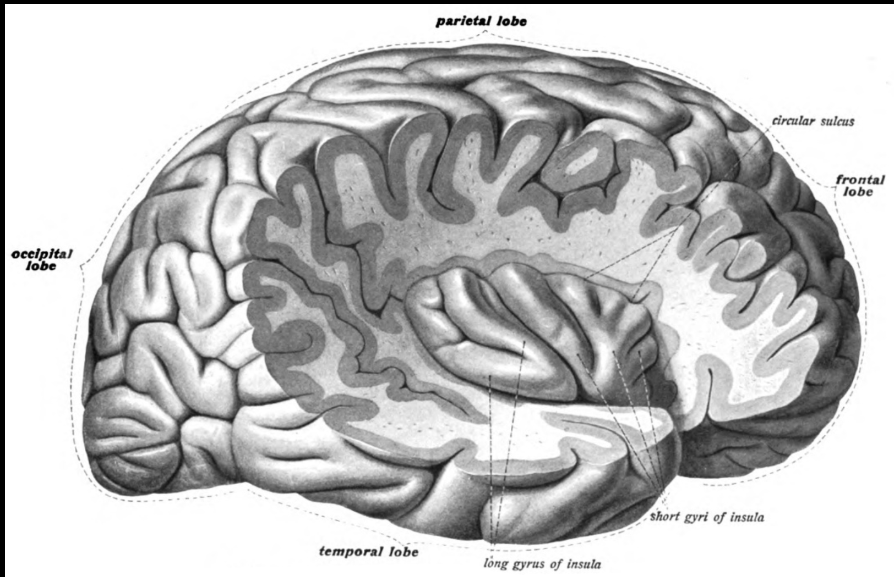

类型:: 学习笔记
领域:: 脑

- 大脑皮层分区 [大脑皮层名字中英文对照表 ](https://www.cnblogs.com/gagag/p/13256638.html) #学习网址
	- 额叶：frontal lope
	- 顶叶：parietal lope
	- 枕叶：occipital lope
	- 颞叶：temporal lope
- 分界线：
	- 额叶和顶叶的分界线：中央沟 Central sulcus
	- 额叶和颞叶的分界线：外侧沟 Lateral sulcus
	- 顶叶和枕叶的分界线：顶枕沟 Parieto-occipital sulcus
- 回忆
	- 区域一
		- 10区 {{cloze prefrontal cortex}} 
		  37区 {{cloze fusiform gyrus }} 
		  40区 {{cloze supramaginal gyrus}} 
		  41、42区 {{cloze primary auditory gyrus}} 
		  46区 {{cloze dorsol prefrontal gyrus}} 
		  47区 {{cloze inferior prefrontal gyrus}}
	- 区域二
		- 23 下后扣带皮层 ventral posterior cingulate cortex
		  24 下前扣带皮层 ventral anterior cingulate cortex
		  25 膝外皮层 subgenual cortex
		  26 压外区 Ectosplenial area
		  27 后内嗅皮层 prilform cortex
		  28 腹侧后扣带皮层 posterior entorhinal cortex
		  29 压后扣带皮层 retrosplenial cingulate cortex
		  31 背侧后扣带皮层 dorsal posterior cingulate cortex
		  32 背侧前扣带皮层 dorsal anterior cingulate cortex
		  33 前扣带皮层一部分
		  34 前嗅皮层 anterior entorhinal cortex
		  35 旁嗅皮层 perirhinal cortex
		  36 海马旁皮层 parahippocampal cortex
- {:height 577, :width 334}{:height 318, :width 412}{:height 291, :width 414}{:height 773, :width 1178}
- **BA3,1,2**  primary somatosensory cortex 初级躯体感觉皮层，在中央后回，位于中央沟、顶叶部分，两个脑区都有 [初级躯体感觉皮层  ](https://en.wikipedia.org/wiki/Primary_somatosensory_cortex#Brodmann_areas_3,_1_and_2)
  >"Somatosensory" 一词由两部分组成： "soma" 和 "sensory"。"Soma" 指的是神经元的细胞体，也就是神经元的主体部分。"Sensory" 意味着感觉的，与感觉相关的。
- **B4** primary motor cortex 初级运动皮层，中央前回，位于额叶背侧，在中央沟前面，两个脑区都有 
  > {:height 267, :width 429}{:height 458, :width 468}
- **B5,7** superior parietal lobule 顶上小叶，前面以中央后沟为界（中央沟后面的第一条沟），与空间认知和视觉感知外，它还与推理、工作记忆和注意力有关
  >{:height 260, :width 273}
- **B6** Premotor cortex 前运动皮层，初级运动皮层前面，在额叶，在行为的直接控制
- **B8** Frontal Eye fields 额眼视野 于[额中回](https://en.wikipedia.org/wiki/Middle_frontal_gyrus)与[中央前回](https://en.wikipedia.org/wiki/Precentral_gyrus)交叉点周围的区域
- **B9** Dorsolateral prefrontal cortex 背外侧前额叶皮层
  "Dorsal" 指的是背部或上方的，通常用来描述身体或器官的背部区域。在解剖学中，它指的是朝向背部的一侧。
  "Lateral" 指的是侧面的或位于一侧的。它用来描述相对于中线或中央轴的位置。
- **B10** Anterior prefrontal cortex  前额叶皮层，它占据了[额上回](https://en.wikipedia.org/wiki/Superior_frontal_gyrus)和[额中回](https://en.wikipedia.org/wiki/Middle_frontal_gyrus)的最喙部
  id:: 65f054af-85c2-4391-a0d3-be983d07ad5b
  anterior" 用于描述相对于中线或中央轴的前部位置
  > {:height 458, :width 468}
- **B11,12** Orbitofrontal cortex 眶额叶皮层
  "Orbito" 指的是眼眶或眶骨，它与眼睛和眼眶相关。在解剖学中，"orbito" 一词通常用来描述与眼眶有关的结构或区域。
  "Frontal" 指的是前额的，与前额叶相关。在大脑解剖学中，"frontal" 用来描述位于大脑前部的区域。
  > {:height 425, :width 441}
- **B13,14** Insular cortex 岛叶皮层 深藏在哺乳动物的[侧沟](https://en.wikipedia.org/wiki/Lateral_sulcus)（将[颞叶](https://en.wikipedia.org/wiki/Temporal_lobe)与[顶](https://en.wikipedia.org/wiki/Parietal_lobe)[叶和额叶](https://en.wikipedia.org/wiki/Frontal_lobe)分开的裂缝）内
  > {:height 385, :width 510}
- B15 在人类中没有发现
- B16 也不太重要
- **B17** Primary visual Cortex 初级视觉皮层
- **B18** Secondary visual Cortex 次级视觉皮层
- **B19** Associate visual Cortex 联想视觉皮层
  >{:height 231, :width 308}从后面看大脑。红色 = b 17（初级视觉皮层）;橙色 = B18;黄色 =  B19
- **B20** 位于颞下回的位置
  >{:height 502, :width 285}{:height 325, :width 414}
- **B21** Middle temporal gyrus大约对应于颞中回
  >{:height 437, :width 282}{:height 285, :width 391}
- **B22** 在颞上后回，[颞上回](https://en.wikipedia.org/wiki/Superior_temporal_gyrus)的一部分，包括在 [Wernicke 区域]
  >{:height 576, :width 378}
- **B23** 位于Posterior cingulate cortex上，位于[后扣带皮层](https://en.wikipedia.org/wiki/Posterior_cingulate_cortex)内。它位于 [Brodmann 区 30](https://en.wikipedia.org/wiki/Brodmann_area_30) 和 [Brodmann 区 31](https://en.wikipedia.org/wiki/Brodmann_area_31) 之间!
  > "Posterior" 是一个拉丁词，通常用于描述位置、方向或时间上的后部或后面。在医学和生物学领域，通常用来指代身体或器官的后部或背面。在神经科学中，"posterior" 通常用来描述大脑中的后部区域或结构。cingulate（扣带回）是大脑皮层的一部分，位于大脑的中央，沿着大脑的中线。
  {:height 630, :width 380}{:height 419, :width 601}
- **B24**  位于anterier cingulate 前扣带皮层上
  {:height 364, :width 362}
- **B25** 位于Ventromedial prefrontal cortex 上，中内侧前额叶皮层
  {:height 586, :width 368}{:height 560, :width 340}左边是B25，右边是中内侧前额叶皮层
- **B26**