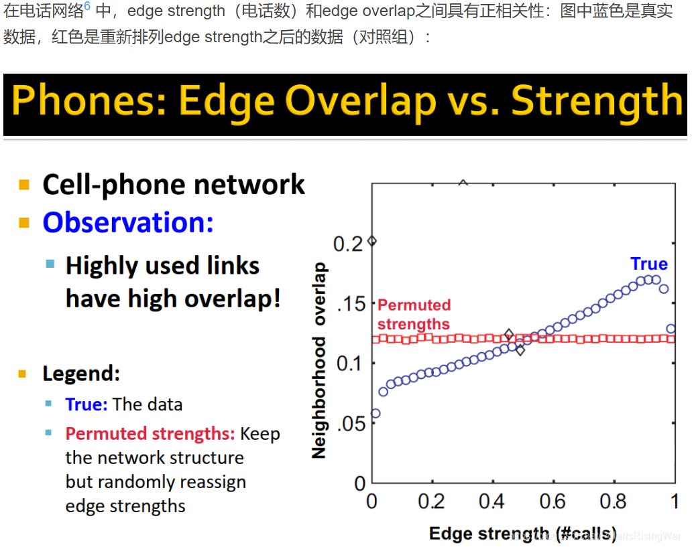

alias:: 社区

- 定义：内部连接紧密，但是社区之间连接不紧密的节点集合
- 社会学存在性：[[Mark Granovetter]]发现人际交往获取的有效知识往往来自于不是非常亲密的熟人。这个与常理相悖，因为我们可能认为好友之间会更相互信任。
  id:: 65a1f40b-9d81-4dea-a0b6-1b38b7ba28dd
	- [[Mark Granovetter]]将边描述为具有两种功能，一种是结构功能，一种是信息功能
		- 结构功能：相邻关系紧密的社交关系的边连接更紧密，是强连接；而关系没有那么紧密的边成为弱连接
		- 信息功能：往往有效信息是在弱连接之间流动的，因为强连接的边往往构成的是一个社区，他们之间彼此连接，信息共享
	- 基于上述理论，我们可以得出网络之间强连接，网络与网络之间弱连接的概念。
	- 举例：
		- edge overlap指的是两个节点的邻居的重合度
		  $$O=\frac{N\left(V\right)\cap N\left(U-\left(i,j\right)\right.}{N\left(V\right)\cup N\left(U\right)-\left(i,j\right)}$$
		- 已经得到证明的是，如果两个节点之间的连接很强的话，这两个节点的edge overlap也很高
		  {:height 606, :width 722}