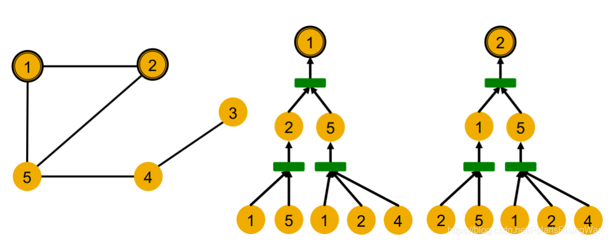
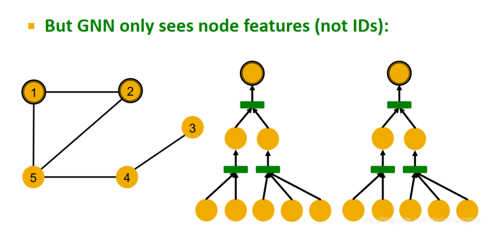
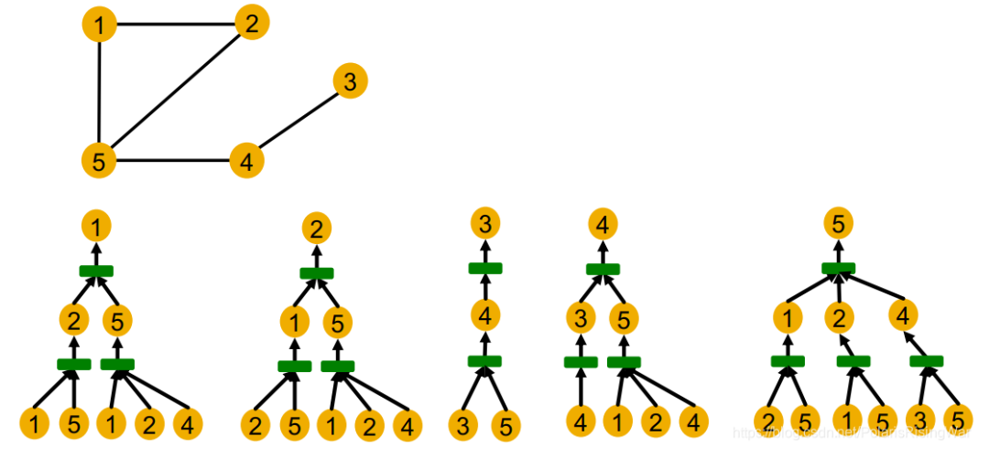

alias:: 计算图

- 定义：图卷积过程中的信息传递图
- 举例：
	- 节点1和节点2的计算图
	  {:height 304, :width 587}
- 存在的问题:
	- GNN过程中是无法区分这两个节点的，因为GNN过程中是不会使用到节点ID信息
	  {:height 304, :width 587}
- 总结：
	- GNN是可能区分开有不同计算图的节点的，一个强表达能力的GNN是区分开任意计算图不同的节点。
	  {:height 304, :width 587}