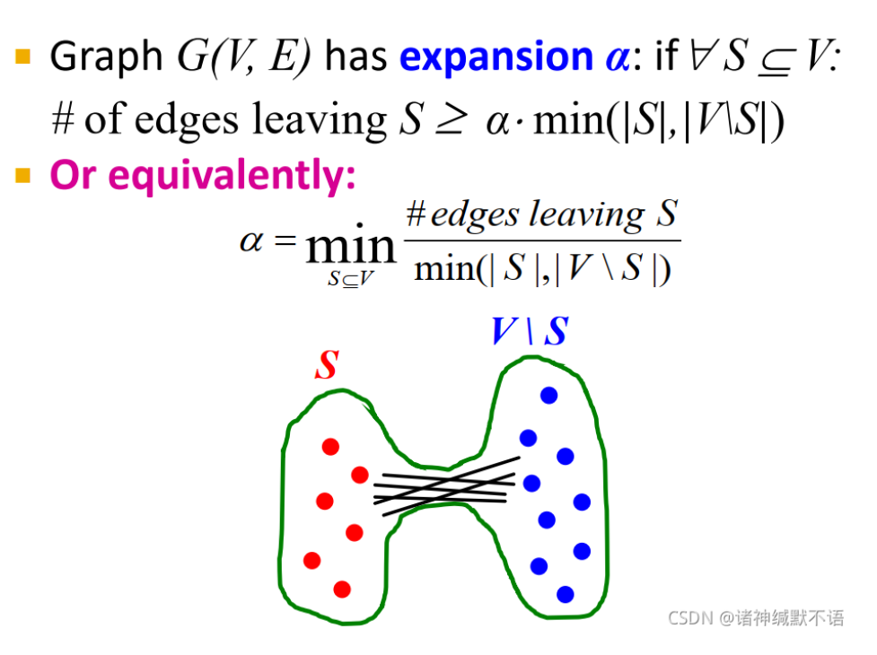
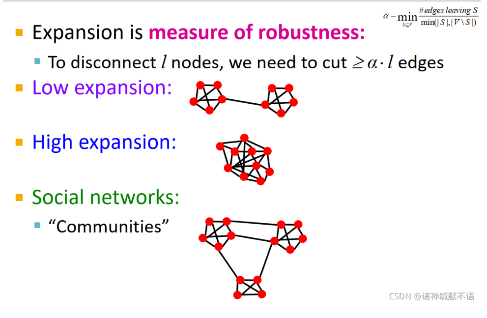

- 定义：图上的一个衡量鲁棒性的概念
  参数$\alpha$：对于任意节点子集$S$，伸出$S$的边数（如图所示，指$S$和$V\backslash S$之间的边）大于等于$\alpha \cdot \min(|S|, |V\backslash S|)$（这个$\min$只是考虑到$|S|$超过$\frac{1}{2}|V|$的可能性，如果$|S|$是小部分的话，可以直接大于等于$\alpha|S|$）
  {:height 381, :width 482}
  其中$\left|V\backslash S\right|$代表的是V减去S后的节点个数，$\left|S\right|$代表S的节点个数
- 意义：
  用于衡量鲁棒性，至少要删去$\#\ \text{edges leaving S}$个边，也就是$\alpha\cdot S$个边，可以让S从V中独立出去，expansion越低的图越容易被处理为非连通分量，越容易被disconnect
  