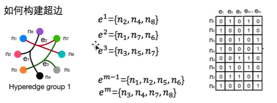
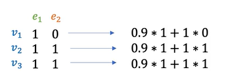
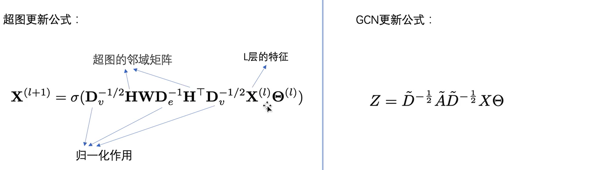

- [[fMRI]] 功能磁共振成像 ((64db41a7-b81b-4133-bd53-d2e46a2b51be))
	- 神经元活动的直接探测需要通过侵入性技术比如插入电极的方式实现，而这可能有悖于人类伦理道德的。**因此我们只能通过其他技术间接推断出大脑不同区域的活动情况**，目前应用较为广泛的便是磁共振成像（MRI）技术。
		- **Diffusion MRI****（扩散磁共振成像）**
			- 利用水分子在组织中的运动来反映大脑活动。
		- **Structure MRI****（****结构性磁共振成像****）**
			- 通过磁共振信号的不同，该技术可以用于区分不同类型的组织，如灰质、白质和脑脊液等
	- **fMRI机制**
		- BOLD信号是通过脑血流动力学和脑代谢活动之间的复杂关系而产生的，也是fMRI技术的核心机制之一。通常来说，当脑区域处于活跃状态时，它会需要更多的氧气和营养物质来支持代谢活动，脑血流的流量也会增加。为了满足这种需求，局部的血管扩张，血流量增加，**血红蛋白上存在一个可以结合氧气的铁离子（Fe 2+），当它与氧气结合时，会形成磁性更强的氧合血红蛋白（oxyhemoglobin），由此导致了磁场变化。相对应的，当脑区域活动减少时，血流量和氧气需求也会降低，血管会收缩，这会导致血红蛋白浓度下降，而另一个未结合氧气的铁离子（Fe3+）的浓度会上升，形成磁性更弱的去氧血红蛋白（deoxyhemoglobin）。这也是fMRI的核心机制。**BOLD信号和神经活动间存在线性的对应关系，这是后续建模的前提。所谓线性，指的是神经活动的强度会与BOLD信号强度等幅变化，当神经信号增强a倍，BOLD信号也会同时增强a倍。
	- **fMRI预处理流程**
		- 其一是**头动校正（head motion correction）**，MRI扫描时，受试者可能会移动，导致图像模糊或变形。头动校正可以将图像中的运动伪影消除。通常会使用与原始数据相同的成像模式（如EPI序列）对每个时间点的图像进行对准和校正。
		- 其二是**失真校正（distortion correction）**,失真校正的主要目的是消除不均匀磁场带来的噪声。
	- **fMRI局限**
		- 首先，fMRI图像的分辨率相对较低。并且在扫描的过程中，扫描速度变快，图片的清晰度就会降低。
		- 其次，fMRI不是对神经元的活动的直接测量，因此很多无关的干扰因素以及后续预处理的方法都可能给结果带来偏差。
		- 由于fMRI需要测量血液中的氧气含量，因此它对血液供应的变化比较敏感，这可能导致图像解读上的偏差。
- [[图神经网络]]((64db4377-9e37-4f82-bd11-ec093e928433))
- BrainGNN 
- dGNN  [dGNN文章解读](https://blog.csdn.net/IanYue/article/details/127639886?ops_request_misc=%257B%2522request%255Fid%2522%253A%2522169216953816800211511143%2522%252C%2522scm%2522%253A%252220140713.130102334..%2522%257D&request_id=169216953816800211511143&biz_id=0&utm_medium=distribute.pc_search_result.none-task-blog-2~all~sobaiduend~default-2-127639886-null-null.142^v92^koosearch_v1&utm_term=dGNN&spm=1018.2226.3001.4187)
- [[HGNN -- hypergraph NN]] [HGNN文章解读](https://zhuanlan.zhihu.com/p/586807239)
	- 超图概念
	  collapsed:: true
		- 边对应多余两个点
		- 在多模态的数据场景中很有用，比简单图构造简单
	- 有新的邻接矩阵
		- 超边的邻接矩阵不再是$N*N$的格式，而是**根据边链接的节点数进行构建**，并且每一个超边都是有自己的权重的（当然这个权重可以是固设置好的，也可以是学习的）
			- 
	- 超图的节点的度、边的度
		- 超图节点的度：对每一个节点的边进行加权求和 (e1的权重是0.9，e2的权重是1)
		- 
		- 超图的边的度：边链接的节点的数目
		-
		-
	- **将GCN应用于超图**
	- 
	-
	- HGNN举例运算[HGNN理论](https://www.bilibili.com/video/BV1bM411j7Dn?p=46&vd_source=19d43a740c787dccf39bbc5751d77b0c)