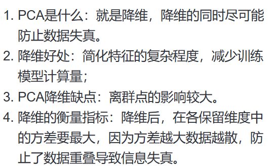
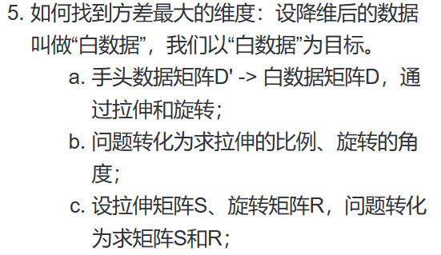
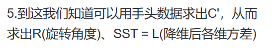
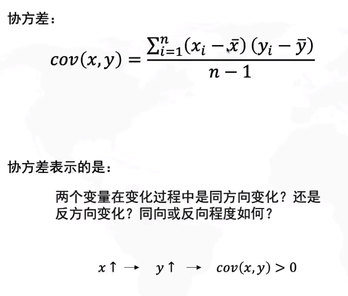
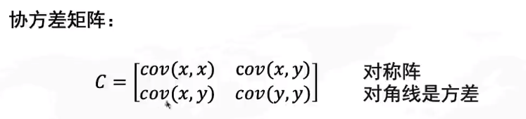
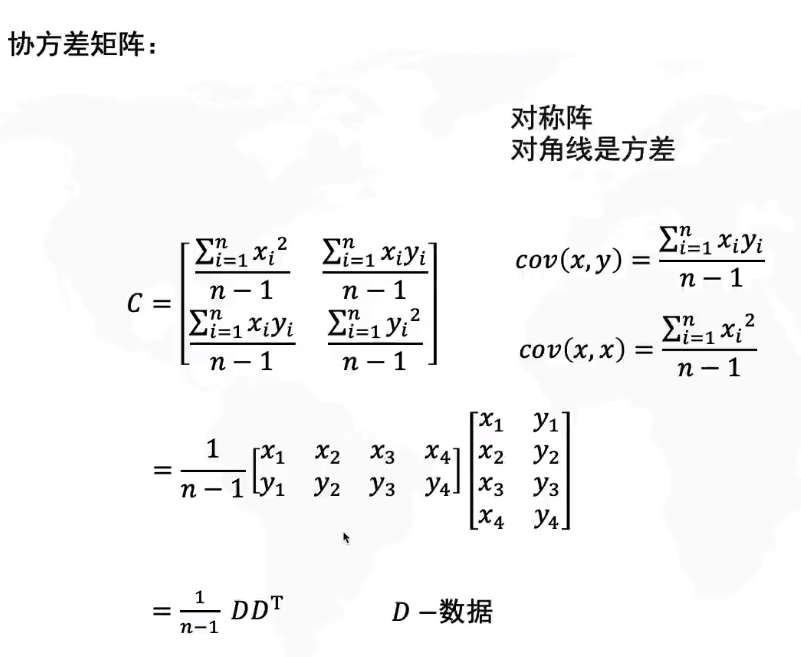
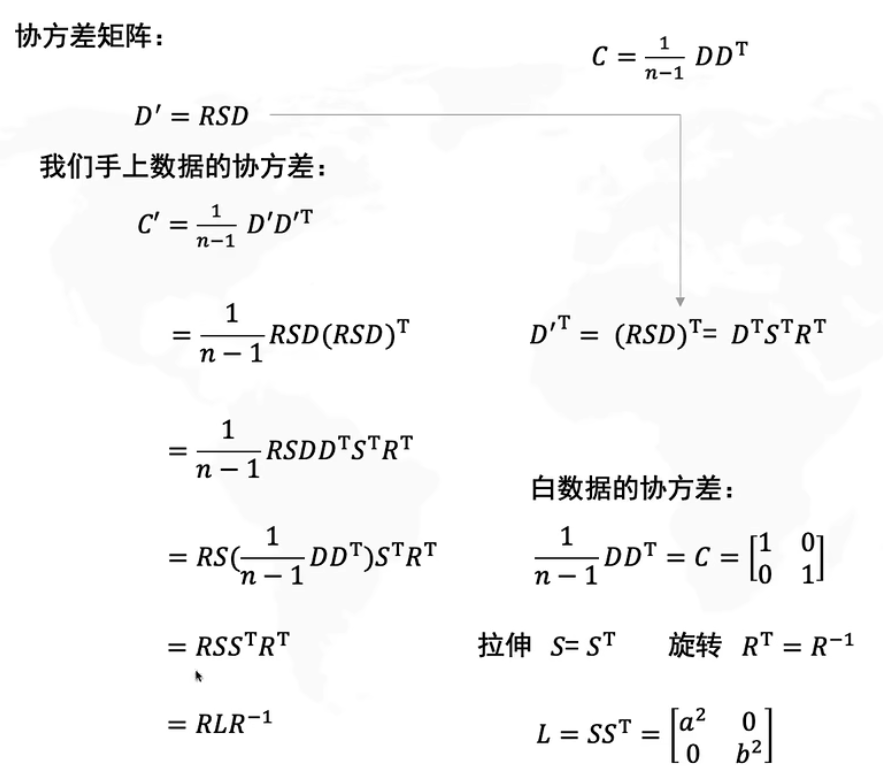

- ((64db1924-e3c7-4dd5-bb14-d8ea9265e89b))
	- [[PCA 主成分分析]]
	  collapsed:: true
		- {{video https://www.bilibili.com/video/BV1E5411E71z/?spm_id_from=333.337.search-card.all.click&vd_source=19d43a740c787dccf39bbc5751d77b0c}}
		- PCA 总结
			- {:height 192, :width 267}
			  {:height 167, :width 277}
			  {:height 57, :width 286}
		- 基本概念集合
			- [[协方差]]：
				- {:height 322, :width 359}
				- 变化程度一样则是正数
			- [[协方差矩阵]]
				- 几个量的解释
					- S -- 拉伸矩阵
					- R -- 旋转矩阵
					- D -- 白数据
				- {:height 122, :width 382}
				- {:height 412, :width 388}
				- {:height 357, :width 392}
				-
- 文中通过英国生物库分类出了**代谢衰老组和神经退行性疾病组**((64db2a60-d9ce-4709-949f-a492e7cff10f))
- ((64db303e-eef3-4b1b-91e4-58a944c96465))
	- [[Mann-Whitney检验]]
		- [两独立样本的秩和检验——Mann-Whitney检验](https://zhuanlan.zhihu.com/p/179273307)
		- 用于**不满足正态分布的小样本**，并且需要对两组数据进行编秩
	- [[Chi-Squared Test]]
		- [Chi-Squared Test(卡方检验) ](https://zhuanlan.zhihu.com/p/394084469)
		- 卡方检验主要用于主要是比较两个及两个以上样本率( 构成比）以及两个分类变量的关联性分析，比如对宠物嗜好上的性别差异，药品A与药品B的有效性差异等等
		  id:: 64db3309-fd5f-42bd-aebb-75bce1a88770
- ((64db3386-6068-4b04-9fed-b596fda351c5))
- ((64db33a0-8f2a-445b-965c-606166db4f6a))
	- [[两步回归法]]
		- 我们首先从大脑形态测量（皮质表面积/皮质厚度/皮质下体积）中回归出其他四个 MetS 成 分 的影响。在下一步中，第一步中的残差作为因变量，MetS 的相关成分作为自变量，同时控 制 表 1 中列出的人口、社会经济和生活方式协变量 。
	- [[协变量]]
		- 协变量是会对实验结果产生影响，但不关心也不可控的变量。
-