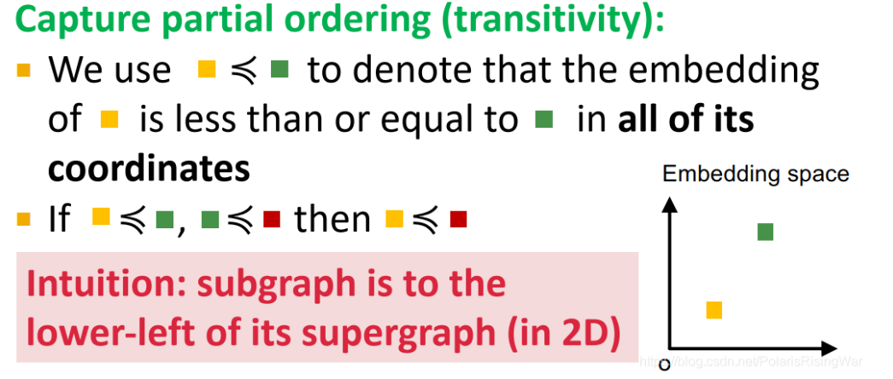

- 定义：将图嵌入到高维空间中的一个点，如果满足
  $$\forall_{i}^{D}Z_{q}\left\lbrack i\right\rbrack\le Z_{u}\left\lbrack i\right\rbrack$$那么$Z_{q}$就是$Z_{u}$的一个子图，并且$Z\left\lbrack i\right\rbrack$都大于0
  
- 为什么可以通过order embedding spaces来编码图的同构关系
	- order embedding spaces可以在嵌入域中反映图域中的同构关系
		- 传递性，A是B的子图，B是C的子图，那么A是C的子图
		- 反对称性，如果AB互为子图那么他们同构
		- 闭包性，单个节点的图是所有非空图的子图，空节点是所有图的子图
- 模型的训练
	- 抽取训练数据
		- 对于$G_{T}$中的子图，直接抽取$G_{T}$的K阶邻居即可
		- 对于$G_{q}$中的子图，采用[[BFS]]抽样的方法