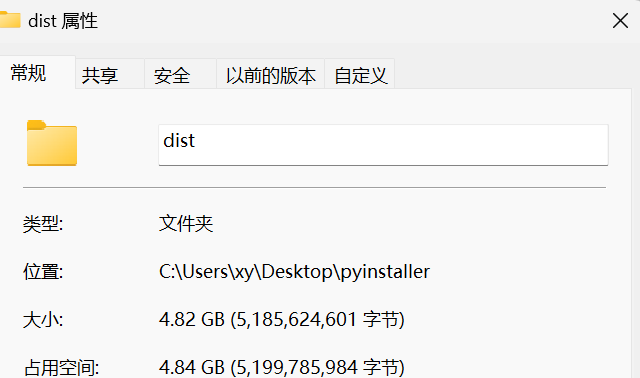

- 优点
- 常用的配置
- 注意事项
	- 打包最好在新的环境打包，自动打包所有的包文件
		- ``12187 INFO: PyTorch version 2.1.0+cu121 available.``
		- {:height 233, :width 398}
	- 报错1：pydicom.encoders.gdcm
	- 报错2：raise error(exception.winerror, exception.function, exception.strerror) win32ctypes.pywin32.pywintypes.error: (225, 'BeginUpdateResourceW', '无法成功完成操作，因为文件包含病毒或潜在的垃圾软件。')
		- 降低version版本
	- **最终的代码**是pyinstaller -F -w --hiddenimport=pydicom.encoders.gdcm --hiddenimport=pydicom.encoders.pylibjpeg  xxx.py
	- 测试1：转化成icon
		- [在线制作ico图标 | 在线ico图标转换工具 方便制作favicon.ico - 比特虫 - Bitbug.net](https://www.bitbug.net/)
- 环境打包
	- 场景
		- 1：别人要运行你的代码，但是没有你的python环境，如果要一个一个python包进行安装，则非常麻烦，并且有时候还安装出现问题。
		- 2：有一个包始终安装不上，但是在你的另一个python环境下有，或者在别人的环境中存在，这个时候就可以将python环境打包，移植到你的电脑上，然后激活该环境，运行对应的项目。
	- 步骤
	  > 1.pip install conda-pack
	  2.conda pack -n [name]-o [aliax].tar.gz
	  3. 转移到新的anaconda/envs ，解压即可
- 注意：这种python环境打包，只能在通一种操作系统中进行，比如你在windows平台上安装的anaconoda，打包anaconda中的python环境到linux服务器中，这样的是用不了的，
-