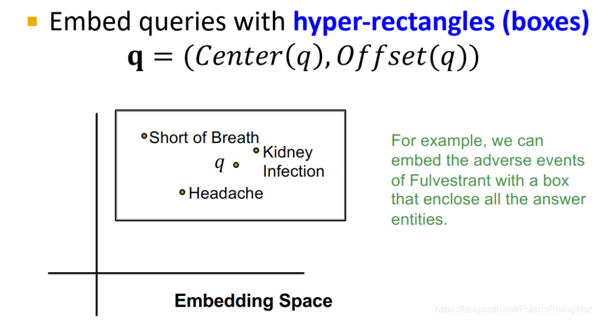
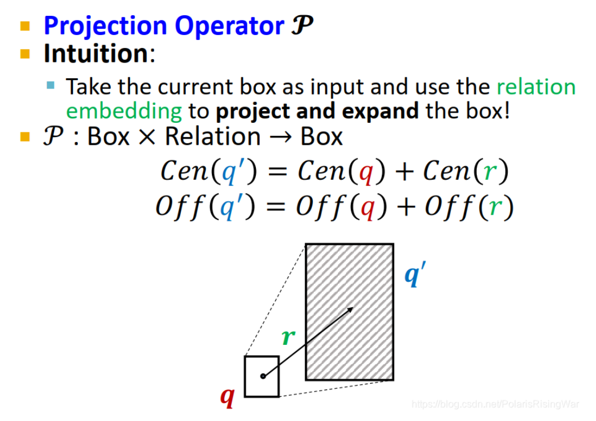
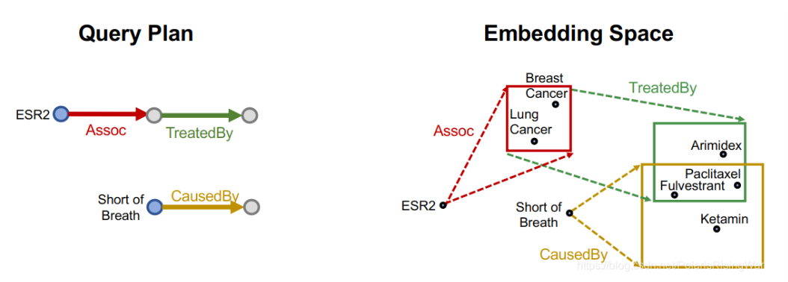

- 定义:用多维长方体来建模$q = (Center(q), Offset(q))$（offset 偏移量的意思）**一个多维长方体，用中心和corner（偏移）来定义。**
  如图所示：在理想状态下，一个box里包含了所有query的回答的实体。（比如图中所示Fulverstrant副作用）
  
- 关键思想：嵌入查询，通过可学习的operator来实现嵌入。**在嵌入域中，query的嵌入应该靠近其答案的嵌入**
- 投影运算$$\mathcal{P} $$:使用关系嵌入将当前盒子作为输入，投影和扩展盒子，得到一个新的盒子。
  id:: 659ce64f-acc8-44bd-8b26-9218739b716e
  $$ \mathcal{P} : \text{Box} \times \text{Relation} \rightarrow \text{Box} $$
  $$Cen(q') = Cen(q) + Cen(r) $$
  $$ Off(q') = Off(q) + Off(r) $$
  {:height 528, :width 734}
- 运算示例：用box embedding，用projection operator，沿query plan求解
  collapsed:: true
	- 可以很容易的完成one-hot、path query、**conjunctive query**的预测
	- 
	- 其中，**conjunctive query**的预测需要定义**intersection**的运算
		- $$ Cen(q_{\text{inter}}) = \sum_{i} w_i \odot Cen(q_i) $$
		  $$ w_i = \frac{\exp(f_{\text{cen}}(Cen(q_j)))}{\sum_{j} \exp(f_{\text{cen}}(Cen(q_i)))} $$
		  $$off(q_{\text{inter}}) = \min(off(q_1),\dots,off(q_n)) \odot \sigma(f_{\text{off}}(off(q_1,\dots,off(q_n))) $$
		  ①其中 \[\odot\] 是哈达玛积，即逐元素乘积。 $$(Cen(q_i) \in \mathbb{R}^d, w_i \in \mathbb{R}^d)$$，\(w_i \in \mathbb{R}^d\) 通过含可训练参数的神经网络 \(f_{cen}\) 计算得到，代表每个输入 \(Cen(q_i)\) 的self-attention得分。
		  ②在$$offset$$表达式中其中 \(\sigma\) 表示sigmoid函数，将输出压缩到 (0,1) 之间，保证收缩。 \(f_{\text{off}}\) 是一个含有可训练参数的神经网络，用来提取输入boxes的表示向量以增强表示能力。
		- 示例
		  
	- union operation：表示AND-OR queries，代表运算中有取并集的操作
		- 问题：我们无法直接再低维空间中嵌入AND-OR queries，而是需要根据query的个数进行升维操作，但是如果query太多了，维度就会很大，所以需要使用新的变换来解决union operation
		- 解决：
			- 采用主析取范式，$$ f(x, y, z) = (x \land \lnot y \land z) \lor (\lnot x \land y) $$，只在最后一步进行union的操作
			- {:height 380, :width 642}
			- 最后采取的计算函数：
				- $$d_{box}(q,v)=\min(d_{box}(q_1,v),\dots,d_{box}(q_m,v))$$
				- 只需要计算最小的举例即可
		-
- 训练流程：
	- 从训练图 $G_{train}$ 中随机抽样一个query $q$，及其答案 $v\in\llbracket q\rrbracket$ 和一个负答案样本 $v'\not\in\llbracket q\rrbracket$。负答案样本是在KG中存在且和$v$同类但非$q$答案的实体。
	- 嵌入query $\mathbf{q}$，计算得分$f_q(v)$和$f_q(v')$，并优化损失函数$\mathcal{l}$以最大化$f_q(v)$并最小化$f_q(v')$：
	  $$\mathcal{l}=-\log\sigma\big(f_q(v)\big)-\log(1-\sigma\big(f_q(v')\big))$$
	  其中$$f_q(v)$$是计算函数
- 如何抽样query？
	- [从模板生成，然后实例化模板生成复杂的queries](https://blog.csdn.net/PolarisRisingWar/article/details/118614563#:~:text=%E6%89%80%E6%9C%89anchor%20nodes-,%E5%AE%9E%E4%BE%8B%E5%8C%96query%20template%E7%A4%BA%E4%BE%8B,-%EF%BC%9A%0A%E4%BB%8Equery)