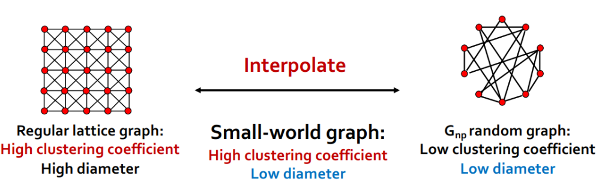

alias:: 小世界图

- 出现动机：现在有高聚集系数、高直径的[[regular lattice graph]]，也有低聚集系数、低直径的 $G_{np}$随机图，但真实图是低直径、高聚集系数的，我们希望找到一个能生成这种图的模型。
- 方法：插值
	- 在 [[regular lattice graph]]和 [[Erdös-Renyi graphs]]的$G_{np}$中进行插值生成的图
	  